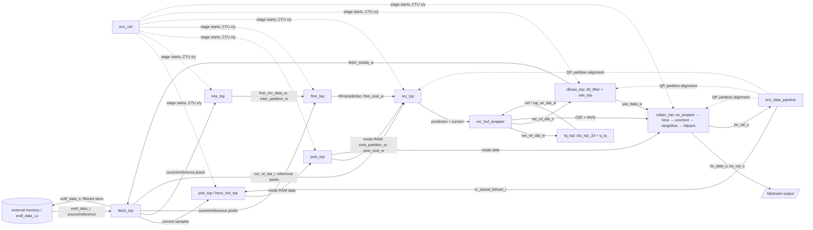

# H.265 algorithm → xk265 RTL traceability

Scope: the checked-in `rtl/**/*.v` implementation, with `sim/top_testbench/tb_enc_top.v` treated separately. This is a static trace, not a conformance claim. Paths and line numbers refer to the working tree on 2026-09-14. Existing architecture notes were used only to locate candidates; conclusions below were checked against RTL. No RTL was changed.

The brief algorithm-role descriptions use the [ITU-T H.265 recommendation](https://www.itu.int/rec/T-REC-H.265-202601-I) as the separate `H265_STANDARD` reference. The recommendation describes decoder syntax/behavior; encoder search and mode-decision choices in xk265 are established only from RTL.

**Evidence key.** `CONFIRMED_RTL` means a port, expression, state transition, or instantiation is visible in RTL. `IMPLIED_BY_CONNECTIVITY` means the role follows from connected producers and consumers without a single proving expression. `CONFIRMED_TESTBENCH` and `CONFIRMED_SOFTWARE` refer only to those separate sources. `INFERRED` is a qualified interpretation; `H265_STANDARD` denotes the algorithmic role, not an implementation assertion. `UNKNOWN` means the searched RTL did not establish the feature. Confidence is high, medium, or low for the *mapping*, not HEVC compliance. Implementation type is deliberately conservative: **hardware-optimized**, **simplified**, **fixed configuration**, **partial**, **not found**, or **unknown**. “Full” is not asserted without exhaustive standard-level verification.

## Forward matrix

| ID | H.265 Function | Algorithm Role | xk265 Module(s) | RTL File(s) | Key Input Signals | Key Output Signals | Consumer | Implementation Type | Evidence | Confidence |
| -- | -- | -- | -- | -- | -- | -- | -- | -- | -- |
| A1 | Frame scheduling | Start and finish pictures | `enc_ctrl`, `h265enc_top` | [enc_ctrl.v](rtl/top/enc_ctrl.v), [enc_top.v](rtl/top/enc_top.v) | `sys_start_i`, `sys_type_i`, `sys_ctu_all_x_i/y_i` | `sys_done_o`, stage starts | fetch, `enc_core` | hardware-optimized | `CONFIRMED_RTL` [ctrl:34–70](rtl/top/enc_ctrl.v#L34), [top:334–549](rtl/top/enc_top.v#L334) | High |
| A2 | CTU traversal and coordinates | Visit coded tree units | `enc_ctrl` | [enc_ctrl.v](rtl/top/enc_ctrl.v) | CTU counts, stage done signals | `prei_x_o/y_o`, `ime_x_o/y_o`, `rec_x_o/y_o`, etc. | stage tops, fetch | hardware-optimized | `CONFIRMED_RTL` [ctrl:145–205](rtl/top/enc_ctrl.v#L145) | High |
| A3 | CU depth / partition tree | Choose CU split structure | `posi_partition_decision`, `ime_partition_decision`, `enc_data_pipeline` | [posi](rtl/posi/posi_partition_decision.v), [ime](rtl/ime/ime_partition_decision.v), [pipeline](rtl/top/enc_data_pipeline.v) | `size_i`, `cst_i`, `dat_bst_partition_w` | `intra_partition_i` (85 bits), `inter_partition_i` (42 bits) | REC, DB, CABAC | hardware-optimized | `CONFIRMED_RTL` [posi:824–845](rtl/posi/posi_partition_decision.v#L824), [ime:873–898](rtl/ime/ime_partition_decision.v#L873), [pipeline:84–110](rtl/top/enc_data_pipeline.v#L84) | High |
| A4 | PU processing | Select inter prediction partitions | `ime_partition_decision_engine`, `mc_ctrl` | [ime](rtl/ime/ime_partition_decision_engine.v), [mc](rtl/rec/rec_mc/mc_ctrl.v) | shape costs, `fmeif_partition_i` | `dat_bst_partition_o`, MC addressing | FME, MC, CABAC | partial | `CONFIRMED_RTL` [ime:101–111](rtl/ime/ime_partition_decision_engine.v#L101), [MC port](rtl/rec/rec_mc/mc_top.v#L35) | Medium |
| A5 | TU traversal | Select transform block work | `intra_ctrl`, `mc_ctrl`, `tq_top` | [intra](rtl/rec/rec_intra/intra_ctrl.v), [mc](rtl/rec/rec_mc/mc_ctrl.v), [tq](rtl/rec/rec_tq/tq_top.v) | partition, block size | `tq_size_i`, residual valid | transform engine | hardware-optimized | `CONFIRMED_RTL` [intra:236–279](rtl/rec/rec_intra/intra_ctrl.v#L236), [tq:469–599](rtl/rec/rec_tq/tq_top.v#L469) | Medium |
| B1 | Intra candidate generation | Propose luma modes | `md_top`, `gxgy`, `compare`, `dc_planar`, `mode_write` | [md_top](rtl/prei/md_top.v), [gxgy](rtl/prei/gxgy.v), [compare](rtl/prei/compare.v), [DC_Plannar](rtl/prei/DC_Plannar.v), [mode_write](rtl/prei/mode_write.v) | current 8×8 samples | `bestmode_o`, PREI mode RAM data | POSI mode read | simplified | `CONFIRMED_RTL` [md wiring:127–250](rtl/prei/md_top.v#L127), [hevc_md_top:88–119](rtl/prei/hevc_md_top.v#L88), [core:576–578](rtl/top/enc_core.v#L576) | High |
| B2 | Intra reference preparation | Form neighboring samples | `posi_reference`, `intra_ref`, `intra_buf_wrapper` | [posi](rtl/posi/posi_reference.v), [rec ref](rtl/rec/rec_intra/intra_ref.v), [buf](rtl/rec/rec_intra/intra_buf_wrapper.v) | top/left and reconstructed pixels | reference sample buses | `posi_prediction`, `intra_pred` | hardware-optimized | `CONFIRMED_RTL` [posi wiring:267–313](rtl/posi/posi_top.v#L267), [rec wiring:235–374](rtl/rec/rec_intra/intra_top.v#L235) | High |
| B3 | Planar prediction | Generate planar pixels | `posi_prediction`, `intra_pred` | [posi](rtl/posi/posi_prediction.v), [rec](rtl/rec/rec_intra/intra_pred.v) | `mode_i`, reference samples | predicted samples | POSI SATD, REC prediction buffer | hardware-optimized | `CONFIRMED_RTL` [rec mode case](rtl/rec/rec_intra/intra_pred.v#L217), [POSI path](rtl/posi/posi_top.v#L313) | Medium |
| B4 | DC prediction | Generate constant/filtered DC pixels | `posi_prediction`, `intra_pred` | [posi](rtl/posi/posi_prediction.v), [rec](rtl/rec/rec_intra/intra_pred.v) | `mode_i`, top/left references | predicted samples | POSI SATD, REC buffer | hardware-optimized | `CONFIRMED_RTL` [rec DC register](rtl/rec/rec_intra/intra_pred.v#L150), [POSI path](rtl/posi/posi_top.v#L313) | Medium |
| B5 | Angular prediction | Project along selected direction | `posi_prediction`, `intra_pred` | [posi](rtl/posi/posi_prediction.v), [rec](rtl/rec/rec_intra/intra_pred.v) | six-bit `mode_i`, top/left references | predicted samples | POSI SATD, REC buffer | hardware-optimized | `CONFIRMED_RTL` [angle LUT:215–227](rtl/rec/rec_intra/intra_pred.v#L215), [index arithmetic:390–410](rtl/rec/rec_intra/intra_pred.v#L390) | High |
| B6 | Intra cost and final mode decision | Compare mode and split costs | `posi_satd_cost`, `posi_rate_estimation`, `posi_partition_decision` | [SATD](rtl/posi/posi_satd_cost.v), [rate](rtl/posi/posi_rate_estimation.v), [decision](rtl/posi/posi_partition_decision.v) | `mode_i`, predicted/current samples, `num_mode_i`, `cst_i` | mode RAM write, `partition_o`, `cost_o` | REC, CABAC, inter/intra comparison | simplified | `CONFIRMED_RTL` [SATD/rate wiring:468](rtl/posi/posi_satd_cost.v#L468), [mode count and compare:173–190, 809–845](rtl/posi/posi_partition_decision.v#L809) | High |
| B7 | Chroma intra prediction | Predict U/V samples | `intra_ctrl`, `intra_ref`, `intra_pred` | [ctrl](rtl/rec/rec_intra/intra_ctrl.v), [ref](rtl/rec/rec_intra/intra_ref.v), [pred](rtl/rec/rec_intra/intra_pred.v) | `ENC_U/V`, mode, reference buses | `pre_dat_o` | REC buffer | partial | `CONFIRMED_RTL` [U/V control:153–166](rtl/rec/rec_intra/intra_ctrl.v#L153), [two pred instances:313–374](rtl/rec/rec_intra/intra_top.v#L313) | Medium |
| C1 | Reference picture access/address | Load and address inter samples | `fetch_wrapper`, `fetch_ref_luma`, `fetch_ref_chroma` | [wrapper](rtl/fetch/fetch_wrapper.v), [luma](rtl/fetch/fetch_ref_luma.v), [chroma](rtl/fetch/fetch_ref_chroma.v) | external interface, `load_ref_*`, IME/FME/MC read addresses | `ime_ref_pel_i`, `fme_ref_pel_i`, `rec_ref_rd_dat_i` | IME, FME, MC | hardware-optimized | `CONFIRMED_RTL` [fetch:469–560](rtl/fetch/fetch_top.v#L469), [core IME/FME ports](rtl/top/enc_core.v#L635) | High |
| C2 | IME search-window and position generation | Enumerate full-pel candidates | `ime_ctrl`, `ime_addressing` | [ctrl](rtl/ime/ime_ctrl.v), [addressing](rtl/ime/ime_addressing.v) | `cmd_dat_i`, center, length, slope, CTU location | reference address, `dat_mv_o`, `dat_cst_mvd_w` | reference fetch, SAD array, cost store | fixed configuration | `CONFIRMED_RTL` [command unpack:189–190](rtl/ime/ime_ctrl.v#L189), [bounds/counters:265–300](rtl/ime/ime_addressing.v#L265), [MV/cost:519–611](rtl/ime/ime_addressing.v#L519) | High |
| C3 | Integer motion estimation / SAD | Evaluate full-pel distortion | `ime_dat_array`, `ime_sad_array`, `ime_cost_store` | [data](rtl/ime/ime_dat_array.v), [SAD](rtl/ime/ime_sad_array.v), [store](rtl/ime/ime_cost_store.v) | current and fetched reference pixels, candidate MV/cost | SAD vectors, best MV/cost | `ime_partition_decision`, IME MV RAM | hardware-optimized | `CONFIRMED_RTL` [SAD outputs:72–96](rtl/ime/ime_sad_array.v#L72), [SAD+MVD:1568](rtl/ime/ime_cost_store.v#L1568), [core IME MV read:640–644](rtl/top/enc_core.v#L640) | High |
| C4 | Inter partition decision | Compare block shapes | `ime_partition_decision`, `ime_partition_decision_engine` | [decision](rtl/ime/ime_partition_decision.v), [engine](rtl/ime/ime_partition_decision_engine.v) | stored shape costs | 42-bit `dat_partition_o` | FME, REC, CABAC | simplified | `CONFIRMED_RTL` [shape compare:101–111](rtl/ime/ime_partition_decision_engine.v#L101), [pack:873–898](rtl/ime/ime_partition_decision.v#L873) | High |
| C5 | Fractional interpolation/refinement | Evaluate half/quarter positions | `fme_ctrl`, `fme_interpolator_8x8`, `fme_interpolator`, `fme_satd_gen`, `fme_cost` | [ctrl](rtl/fme/fme_ctrl.v), [8×8](rtl/fme/fme_interpolator_8x8.v), [filter](rtl/fme/fme_interpolator.v), [SATD](rtl/fme/fme_satd_gen.v), [cost](rtl/fme/fme_cost.v) | IME MV, `fme_ref_pel_i`, `fme_cur_pel_i`, `half_ip_flag_i` | `fmv_best_o`, `best_cost_o` | FME MV buffer, REC MC | hardware-optimized | `CONFIRMED_RTL` [FME chain:465–630](rtl/fme/fme_top.v#L465), [9-way compare:504–557](rtl/fme/fme_cost.v#L504) | High |
| C6 | Merge-neighbor candidates | Read spatial MV candidates | `fme_mv_candidate_prepare`, `fme_mv_buffer` | [candidate](rtl/fme/fme_mv_candidate_prepare.v), [buffer](rtl/fme/fme_mv_buffer.v) | current/top/left MV memories; PU coordinates | A0/A1/B0/B1/B2 data + valid | `fme_skip` | partial | `CONFIRMED_RTL` [candidate ports:82–110](rtl/fme/fme_mv_candidate_prepare.v#L82), [address select:342–440](rtl/fme/fme_mv_candidate_prepare.v#L342) | High |
| C7 | Skip selection | Choose low-cost no-residual path | `fme_skip`, `rec_buf_wrapper` | [skip](rtl/fme/fme_skip.v), [REC buffer](rtl/rec/rec_wrapper/rec_buf_wrapper.v) | candidate MVs, SATD/cost, thresholds | `skip_flg_o`, `skip_idx_o`, prediction-only reconstruction | REC, CABAC | simplified | `CONFIRMED_RTL` [fixed skip MV/bitrate:724–769](rtl/fme/fme_skip.v#L724), [cost compare:838](rtl/fme/fme_skip.v#L838), [REC bypass:1276](rtl/rec/rec_wrapper/rec_buf_wrapper.v#L1276) | High |
| C8 | Motion compensation | Form final inter Y/U/V prediction | `mc_top`, `mc_chroma_top`, `mc_chroma_filter_hor`, `mc_chroma_filter_ver`, `fme_pred` | [MC](rtl/rec/rec_mc/mc_top.v), [chroma](rtl/rec/rec_mc/mc_chroma_top.v), [filter](rtl/rec/rec_mc/mc_chroma_filter.v), [FME pred](rtl/fme/fme_pred.v) | selected FME MV, reference pixels, FME prediction buffer | `pre_data_o`/`pre_dat_o` | REC subtraction/reconstruction | hardware-optimized | `CONFIRMED_RTL` [MC ports:424–480](rtl/rec/rec_top.v#L424), [MC children:275–356](rtl/rec/rec_mc/mc_top.v#L275), [chroma filter instantiation](rtl/rec/rec_mc/mc_chroma_ip_1p.v#L197) | High |
| D1 | CTU-level inter vs intra choice | Select prediction path by aggregate cost | `rec_top`, `IinP_flag_gen` | [rec_top](rtl/rec/rec_top.v), [flag](rtl/rec/IinP_flag_gen.v) | `IinP_cst_I_i`, `IinP_cst_P_i`, `type_i`, `IinP_ena_i` | `type_r`, `IinP_flag_o` | REC prediction selector, DB, CABAC | simplified | `CONFIRMED_RTL` [core cost wiring:817–822](rtl/top/enc_core.v#L817), [single type register compare:327–339](rtl/rec/rec_top.v#L327) | High |
| D2 | Lambda / approximate rate cost | Penalize signaling bits | `ime_addressing`, `posi_rate_estimation`, `qp_lambda_table`, `fme_cost` | [IME](rtl/ime/ime_addressing.v), [POSI](rtl/posi/posi_rate_estimation.v), [LUT](rtl/fme/qp_lambda_table.v), [FME](rtl/fme/fme_cost.v) | QP/MV/signaling bits | weighted costs | mode and MV selectors | simplified | `CONFIRMED_RTL` [IME lambda LUT + multiply:567–611](rtl/ime/ime_addressing.v#L567), [FME LUT hookup:460](rtl/fme/fme_top.v#L460), [FME SATD+MV cost:504–512](rtl/fme/fme_cost.v#L504) | High |
| E1 | Prediction subtraction / residual | Subtract prediction from source | `rec_buf_wrapper` | [rec_buf_wrapper.v](rtl/rec/rec_wrapper/rec_buf_wrapper.v) | `cur_rd_dat_i`, `pre_wr_dat_i` | `res_wr_dat_o` | `tq_top` | hardware-optimized | `CONFIRMED_RTL` [lane subtraction:742–773](rtl/rec/rec_wrapper/rec_buf_wrapper.v#L742), [REC→TQ:501–521](rtl/rec/rec_top.v#L501) | High |
| E2 | Transform selection and forward transform | Map residual to coefficients | `tq_top`, `dct_top_2d`, `be`, `re`, `pe`, `transform_mtr` | [TQ](rtl/rec/rec_tq/tq_top.v), [DCT](rtl/rec/rec_tq/dct_top_2d.v), [BE](rtl/rec/rec_tq/be.v), [RE](rtl/rec/rec_tq/re.v), [PE](rtl/rec/rec_tq/pe.v), [matrix](rtl/rec/rec_tq/transform_mtr.v) | `tq_res_i`, `tq_size_i`, `i_inverse=0`, `i_tq_sel` | `o_d_*` coefficients | `q_iq` | hardware-optimized | `CONFIRMED_RTL` [TQ/DCT hookup:623–714](rtl/rec/rec_tq/tq_top.v#L623), [engine children:1079–1606](rtl/rec/rec_tq/dct_top_2d.v#L1079) | High |
| F1 | QP and chroma QP | Set quantization strength | `rate_control`, `enc_data_pipeline`, `chroma_qp` | [RC](rtl/prei/rate_control.v), [pipeline](rtl/top/enc_data_pipeline.v), [chroma](rtl/rec/rec_tq/chroma_qp.v) | initial QP, actual bits, ROI, component | `rc_qp_o`, stage QPs, `qp_yuv` | POSI, FME, TQ, DB, CABAC | fixed configuration | `CONFIRMED_RTL` [RC update:155–243](rtl/prei/rate_control.v#L155), [QP stages:154–174](rtl/top/enc_data_pipeline.v#L154), [chroma hookup:699](rtl/rec/rec_tq/tq_top.v#L699) | High |
| F2 | Quantization / inverse quantization | Scale coefficients and recover levels | `q_iq`, `quan` | [q_iq.v](rtl/rec/rec_tq/q_iq.v), [quan.v](rtl/rec/rec_tq/quan.v) | transform outputs, `qp_yuv`, `inverse`, size | quantized coefficients to CEF; inverse values to DCT | REC CEF RAM, inverse transform | hardware-optimized | `CONFIRMED_RTL` [TQ q_iq hookup:711](rtl/rec/rec_tq/tq_top.v#L711), [q_iq size/inverse:632–742](rtl/rec/rec_tq/q_iq.v#L632) | High |
| G1 | Inverse transform | Recover reconstructed residual | `tq_top`, `dct_top_2d` | [TQ](rtl/rec/rec_tq/tq_top.v), [DCT](rtl/rec/rec_tq/dct_top_2d.v) | CEF readback, inverse quantized coefficients | `rec_data_o`, `rec_val_o` | `rec_buf_wrapper` | hardware-optimized | `CONFIRMED_RTL` [inverse mux:333–401](rtl/rec/rec_tq/tq_top.v#L333), [REC response wire:501–521](rtl/rec/rec_top.v#L501) | High |
| G2 | Prediction + residual / clip | Reconstruct 8-bit samples | `rec_buf_wrapper` | [rec_buf_wrapper.v](rtl/rec/rec_wrapper/rec_buf_wrapper.v) | `rsp_wr_dat_i`, prediction RAM | `rec_wr_dat_o`, CBF | REC RAM, DB | hardware-optimized | `CONFIRMED_RTL` [add/skip mux:1276–1307](rtl/rec/rec_wrapper/rec_buf_wrapper.v#L1276), [0…255 clip:1243–1274](rtl/rec/rec_wrapper/rec_buf_wrapper.v#L1243) | High |
| G3 | Reconstructed CTU storage | Retain samples for neighbor/filter use | `rec_buf_rec_rot`, `rec_buf_rec` | [rotation](rtl/rec/rec_wrapper/rec_buf_rec_rot.v), [RAM](rtl/rec/rec_wrapper/rec_buf_rec.v) | reconstructed writes | `rec_rd_dat_o` | intra reference, DB | hardware-optimized | `CONFIRMED_RTL` [buffer instance:1165](rtl/rec/rec_wrapper/rec_buf_wrapper.v#L1165), [REC/DB read wiring:786–799](rtl/top/enc_core.v#L786) | High |
| H1 | Deblocking edge/strength | Mark TU/PU edges; select BS | `db_bs`, `db_tu_edge`, `db_pu_edge`, `db_filter`, `db_mv`, `db_qp` | [BS](rtl/db/db_bs.v), [TU](rtl/db/db_tu_edge.v), [PU](rtl/db/db_pu_edge.v), [filter](rtl/db/db_filter.v), [MV](rtl/db/db_mv.v), [QP](rtl/db/db_qp.v) | partition, CBF, MV, QP | `tu_edge_o`, `pu_edge_o`, `bs_w`, beta/tc | filtering | simplified | `CONFIRMED_RTL` [edge units:193–277](rtl/db/db_bs.v#L193), [BS expression:135–164](rtl/db/db_filter.v#L135), [LUTs:123–131](rtl/db/db_filter.v#L123) | High |
| H2 | Luma/chroma deblocking | Smooth eligible boundaries | `db_filter`, `db_normal_filter`, `db_strong_filter`, `db_chroma_filter`, `dbsao_datapath` | [filter](rtl/db/db_filter.v), [normal](rtl/db/db_normal_filter.v), [strong](rtl/db/db_strong_filter.v), [chroma](rtl/db/db_chroma_filter.v), [datapath](rtl/db/dbsao_datapath.v) | REC pixels, BS, beta/tc, enable | `rec_pxl_o` | REC RAM, SAO | hardware-optimized | `CONFIRMED_RTL` [filter engines:344–429](rtl/db/db_filter.v#L344), [DB→SAO path:282–346](rtl/db/dbsao_top.v#L282) | High |
| H3 | SAO statistics/offset choice | Compare original and deblocked samples | `sao_statistic`, `sao_sum_diff`, `sao_cal_offset`, `sao_type_decision`, `sao_mode` | [statistics](rtl/db/sao_statistic.v), [sum](rtl/db/sao_sum_diff.v), [offset](rtl/db/sao_cal_offset.v), [type](rtl/db/sao_type_decision.v), [mode](rtl/db/sao_mode.v) | original and reconstructed sample lines, QP/enables | type/subtype/offset | `sao_add_offset`, CABAC SAO syntax | hardware-optimized | `CONFIRMED_RTL` [SAO chain:175–548](rtl/db/sao_top.v#L175), [62-bit syntax output](rtl/db/sao_top.v#L603) | High |
| H4 | SAO sample filtering / filtered storage | Apply chosen offsets and write filtered pixels | `sao_add_offset`, `dbsao_datapath`, `fetch_db` | [offset](rtl/db/sao_add_offset.v), [datapath](rtl/db/dbsao_datapath.v), [fetch_db](rtl/fetch/fetch_db.v) | `sao_block_i`, type/offset; deblocked pixels | `sao_block_o`, DB store pixels | external store/ref path | hardware-optimized | `CONFIRMED_RTL` [SAO output:548–603](rtl/db/sao_top.v#L548), [DB write path:282–346](rtl/db/dbsao_top.v#L282), [fetch DB instance](rtl/fetch/fetch_top.v#L563) | Medium |
| I1 | Syntax generation | Gather CU/PU/TU, coeff, MVD, SAO syntax | `cabac_se_prepare` plus `cabac_se_prepare_*` children | [prepare](rtl/cabac/cabac_se_prepare.v), [children](rtl/cabac/) | partitions, mode RAM, MVD, CEF, SAO, QP | `syntax_element_0_o`…`3_o`, valid | `cabac_pipo`, `cabac_bina` | partial | `CONFIRMED_RTL` [top syntax ports:406–467](rtl/cabac/cabac_top.v#L406), [source wiring](rtl/top/enc_core.v#L918) | High |
| I2 | Binarization / bin ordering | Turn syntax into bins and order them | `cabac_bina`, `cabac_binsort` | [bina](rtl/cabac/cabac_bina.v), [sort](rtl/cabac/cabac_binsort.v) | syntax elements, `ctxIdx_*`, cMax | bin symbols, bypass indices | context stage | hardware-optimized | `CONFIRMED_RTL` [top:496–582](rtl/cabac/cabac_top.v#L496) | High |
| I3 | Context selection/update | Get and change probability state | `cabac_ucontext`, `cabac_ucontext_t`, `cabac_ucontext_tt` | [context](rtl/cabac/cabac_ucontext.v), [t](rtl/cabac/cabac_ucontext_t.v), [tt](rtl/cabac/cabac_ucontext_tt.v) | bin context indices, symbols, QP/slice init | `out_context_*`, LPS/MPS state | RLPS/range stage | hardware-optimized | `CONFIRMED_RTL` [top context outputs:582–613](rtl/cabac/cabac_top.v#L582), [context module](rtl/cabac/cabac_ucontext.v#L21) | Medium |
| I4 | Arithmetic range/low coding and bypass | Update arithmetic interval | `cabac_rlps4`, `cabac_urange4`, `cabac_binmix`, `cabac_ulow`, `cabac_ulow_refine` | [RLPS](rtl/cabac/cabac_rlps4.v), [range](rtl/cabac/cabac_urange4.v), [mix](rtl/cabac/cabac_binmix.v), [low](rtl/cabac/cabac_ulow.v), [refine](rtl/cabac/cabac_ulow_refine.v) | bins, contexts, `index_bypass`, range/low | updated range/low, shifts, overflow | bit packer | hardware-optimized | `CONFIRMED_RTL` [top chain:613–842](rtl/cabac/cabac_top.v#L613), [low register/updates:131–249](rtl/cabac/cabac_ulow.v#L131) | High |
| I5 | CABAC termination / bit packing | Flush coding state to bytes | `cabac_ulow`, `cabac_bitpack` | [low](rtl/cabac/cabac_ulow.v), [pack](rtl/cabac/cabac_bitpack.v) | end coding control, low/overflow | `bs_data_o`, `bs_val_o` | external bitstream, RC bit counter | partial | `CONFIRMED_RTL` [low flush branch:316–321](rtl/cabac/cabac_ulow.v#L316), [bitpack hookup:842–858](rtl/cabac/cabac_top.v#L842), [feedback:995](rtl/top/enc_core.v#L995); exact terminate-bin semantics remain `UNKNOWN` | Medium |
| J1 | Hardware CTU QP/rate feedback | Adjust QP to bit budget | `rate_control`, `enc_data_pipeline` | [rate](rtl/prei/rate_control.v), [pipeline](rtl/top/enc_data_pipeline.v) | `rc_actual_bitnum_i`, budget, initial QP, ROI | `rc_qp_o`, stage QPs | POSI/FME/REC/DB/CABAC | simplified | `CONFIRMED_RTL` [rate arithmetic:155–243](rtl/prei/rate_control.v#L155), [bit counter:246](rtl/top/enc_data_pipeline.v#L246) | High |
| K1 | Spatial MV neighbors | Preserve current/top/left vectors | `fme_mv_buffer`, `fme_mv_candidate_prepare`, `db_mv` | [FME buffer](rtl/fme/fme_mv_buffer.v), [candidate](rtl/fme/fme_mv_candidate_prepare.v), [DB](rtl/db/db_mv.v) | FME MV writes, PU coordinates | neighbor candidates, boundary MVs | skip/merge path, DB strength | hardware-optimized | `CONFIRMED_RTL` [FME candidate reads:387–440](rtl/fme/fme_mv_candidate_prepare.v#L387), [DB MV RAMs:212–221](rtl/db/db_mv.v#L212) | High |
| K2 | Intra/CU neighbors | Preserve mode and reconstructed border | `intra_ref`, `intra_buf_wrapper`, `prei_md_ram_sp_85x6`, `posi_md_ram_sp_64x6` | [intra ref](rtl/rec/rec_intra/intra_ref.v), [buf](rtl/rec/rec_intra/intra_buf_wrapper.v), [PREI RAM](rtl/mem/prei_md_ram_sp_85x6.v), [POSI RAM](rtl/mem/posi_md_ram_sp_64x6.v) | prior reconstructed samples, mode writes | reference bus, mode reads | POSI, REC, CABAC | hardware-optimized | `CONFIRMED_RTL` [intra path](rtl/rec/rec_intra/intra_top.v#L235), [PREI→POSI](rtl/top/enc_core.v#L549), [POSI→REC/EC](rtl/top/enc_core.v#L590) | High |

The following subfunction rows resolve shared datapaths in E2/F2/H2/H3/I3/I4/J1 without asserting separate top-level engines:

| ID | H.265 Function | Algorithm Role | xk265 Module(s) | RTL File(s) | Key Input Signals | Key Output Signals | Consumer | Implementation Type | Evidence | Confidence |
| -- | -- | -- | -- | -- | -- | -- | -- | -- | -- |
| E2a | Transform choice | Select size/type | `tq_top`, `dct_top_2d` | [TQ](rtl/rec/rec_tq/tq_top.v), [DCT](rtl/rec/rec_tq/dct_top_2d.v) | `tq_size_i`, `tq_sel_i`, `type_i` | `i_transize`, `i_tq_sel` | `be`/`re`/`pe` | partial | `CONFIRMED_RTL` [TQ size/selector:10–11,623–629](rtl/rec/rec_tq/tq_top.v#L10); exact DST choice `UNKNOWN` | Medium |
| E2b | Forward transform and coefficients | Transform residual | `dct_top_2d`, `be`, `re`, `pe`, `transform_mtr` | [DCT](rtl/rec/rec_tq/dct_top_2d.v), [stages](rtl/rec/rec_tq/) | residual lanes, `i_inverse=0` | `o_d_*` | `q_iq` | hardware-optimized | `CONFIRMED_RTL` [TQ hookup:623–714](rtl/rec/rec_tq/tq_top.v#L623) | High |
| F2a | Quantization and coefficient scaling | Produce transmitted levels | `q_iq`, `quan` | [q_iq](rtl/rec/rec_tq/q_iq.v), [quan](rtl/rec/rec_tq/quan.v) | transform coefficients, QP, size | quantized CEF | REC CEF RAM, CABAC | hardware-optimized | `CONFIRMED_RTL` [q_iq:735](rtl/rec/rec_tq/q_iq.v#L735), [TQ:711](rtl/rec/rec_tq/tq_top.v#L711) | High |
| F2b | Inverse quantization | Restore local transform values | `q_iq`, `quan` | [q_iq](rtl/rec/rec_tq/q_iq.v), [quan](rtl/rec/rec_tq/quan.v) | CEF readback, QP, inverse phase | inverse levels | `dct_top_2d` | hardware-optimized | `CONFIRMED_RTL` [q_iq inverse/size:632–742](rtl/rec/rec_tq/q_iq.v#L632) | High |
| H2a | Luma deblocking | Smooth luma edge | `db_filter`, `db_normal_filter`, `db_strong_filter` | [filter](rtl/db/db_filter.v), [normal](rtl/db/db_normal_filter.v), [strong](rtl/db/db_strong_filter.v) | luma pixels, BS, beta/tc | filtered luma | `dbsao_datapath` | hardware-optimized | `CONFIRMED_RTL` [filter:344–397](rtl/db/db_filter.v#L344) | High |
| H2b | Chroma deblocking | Smooth chroma edge | `db_filter`, `db_chroma_filter` | [filter](rtl/db/db_filter.v), [chroma](rtl/db/db_chroma_filter.v) | chroma pixels, BS/tc | filtered chroma | `dbsao_datapath` | partial | `CONFIRMED_RTL` [filter:398–435](rtl/db/db_filter.v#L398) | High |
| H3a | SAO statistics | Accumulate reconstruction error by class | `sao_statistic`, `sao_sum_diff` | [stat](rtl/db/sao_statistic.v), [sum](rtl/db/sao_sum_diff.v) | original/deblocked lines | class sums | `sao_cal_offset` | hardware-optimized | `CONFIRMED_RTL` [sao_top:216–401](rtl/db/sao_top.v#L216) | High |
| H3b | SAO mode and offset selection | Choose offset/class | `sao_mode`, `sao_cal_offset`, `sao_type_decision` | [mode](rtl/db/sao_mode.v), [cal](rtl/db/sao_cal_offset.v), [type](rtl/db/sao_type_decision.v) | class statistics, QP | type/subtype/offset | `sao_add_offset`, CABAC | hardware-optimized | `CONFIRMED_RTL` [sao_top:175,401–532](rtl/db/sao_top.v#L175) | High |
| I3a | CABAC context selection | Resolve context index to state | `cabac_binsort`, `cabac_ucontext` | [sort](rtl/cabac/cabac_binsort.v), [context](rtl/cabac/cabac_ucontext.v) | `ctxIdx_*`, sorted bins | `out_context_*` | `cabac_rlps4` | hardware-optimized | `CONFIRMED_RTL` [cabac_top:546–613](rtl/cabac/cabac_top.v#L546) | High |
| I3b | CABAC context update | Adapt MPS/state | `cabac_ucontext_t`, `cabac_ucontext_tt` | [t](rtl/cabac/cabac_ucontext_t.v), [tt](rtl/cabac/cabac_ucontext_tt.v) | bin symbol, prior context | updated context | `cabac_ucontext` state array | hardware-optimized | `CONFIRMED_RTL` [context child instances:178–226](rtl/cabac/cabac_ucontext.v#L178) | Medium |
| I4a | CABAC range update | Renormalize coding interval | `cabac_rlps4`, `cabac_urange4` | [RLPS](rtl/cabac/cabac_rlps4.v), [range](rtl/cabac/cabac_urange4.v) | context, bins, prior range | `out_ur_range_*`, shifts | `cabac_binmix`, `cabac_ulow` | hardware-optimized | `CONFIRMED_RTL` [cabac_top:613–699](rtl/cabac/cabac_top.v#L613) | High |
| I4b | CABAC low/bypass update | Accumulate coded interval/bypass bits | `cabac_binmix`, `cabac_ulow`, `cabac_ulow_refine` | [mix](rtl/cabac/cabac_binmix.v), [low](rtl/cabac/cabac_ulow.v), [refine](rtl/cabac/cabac_ulow_refine.v) | range/shifts, MPS/LPS, bypass | low/overflow, bit string | `cabac_bitpack` | hardware-optimized | `CONFIRMED_RTL` [cabac_top:699–842](rtl/cabac/cabac_top.v#L699), [low:131–249](rtl/cabac/cabac_ulow.v#L131) | High |
| J1a | Bit-count feedback | Count emitted bytes | `enc_data_pipeline` | [file](rtl/top/enc_data_pipeline.v) | `bs_val_i` | `rc_actual_bitnum_o` | `rate_control.actual_bitnum_i` | simplified | `CONFIRMED_RTL` [counter:243–255](rtl/top/enc_data_pipeline.v#L243), [PREI:120–129](rtl/prei/prei_top.v#L120) | High |

### Configuration and testbench boundaries

| Function | Separate source | Observed behavior | Evidence | Consequence |
| -- | -- | -- | -- | -- |
| Frame type and frame QP | Testbench | Reads `rc_frameqp.txt`, sets `sys_type` from GOP position, loads `sys_init_qp` | `CONFIRMED_TESTBENCH` [tb:962–1000](sim/top_testbench/tb_enc_top.v#L962) | This is not proof of software rate control inside RTL. |
| IME search commands | Testbench/config file | `$fscanf` loads center, length, slope, downsample, partition, feedback into command bus | `CONFIRMED_TESTBENCH` [tb:670–855](sim/top_testbench/tb_enc_top.v#L670) | The RTL searches commanded positions; one named algorithm cannot be asserted for all configurations. |
| Reference picture / DPB | Testbench | `ext_ref_yuv` may be filled from file or previous `ext_rec_yuv` under `USE_HW_DPB` | `CONFIRMED_TESTBENCH` [tb:898–939, 1018–1020](sim/top_testbench/tb_enc_top.v#L898) | Frame-level DPB ownership is not demonstrated as an on-chip RTL memory. |
| DB/SAO enable and bypass | Testbench | `sys_dbsao_ena` drives both DB and SAO enable; testbench contains force overrides | `CONFIRMED_TESTBENCH` [tb:225–226, 613–630](sim/top_testbench/tb_enc_top.v#L225) | Simulation behavior can differ from unforced RTL; inspect preprocessor guard before interpreting a run. |
| Software encoder interaction | `sw/` artifacts | Prebuilt vectors/binaries exist, but this analysis found no executable software-control interface in RTL | `UNKNOWN` | No claim of software-side algorithm implementation is made. |

## Reverse matrix: RTL module → algorithm

Each row names a real module declaration. Major signals are interface-level names; the forward matrix gives the evidence for functional arithmetic. Repeated helper instances are grouped by declared module.

| RTL Module | File | Parent | H.265 Function(s) | Major Inputs | Major Outputs | Evidence |
| -- | -- | -- | -- | -- | -- | -- |
| `enc_ctrl` | [file](rtl/top/enc_ctrl.v) | `h265enc_top` | A1–A2 scheduling/traversal | `sys_start_i`, done signals, CTU totals | stage starts and CTU x/y | `CONFIRMED_RTL` [top:334](rtl/top/enc_top.v#L334) |
| `fetch_top` / `fetch_wrapper` | [top](rtl/fetch/fetch_top.v), [wrapper](rtl/fetch/fetch_wrapper.v) | `h265enc_top` / `fetch_top` | C1, H4 memory movement | load/store enables, external data | local sample buses, external commands | `CONFIRMED_RTL` [top:413](rtl/top/enc_top.v#L413) |
| `fetch_ref_luma` / `fetch_ref_chroma` | [luma](rtl/fetch/fetch_ref_luma.v), [chroma](rtl/fetch/fetch_ref_chroma.v) | `fetch_top` | C1 reference access | external ref data, read addresses | IME/FME/MC pixels | `CONFIRMED_RTL` [fetch:469–560](rtl/fetch/fetch_top.v#L469) |
| `fetch_db` | [file](rtl/fetch/fetch_db.v) | `fetch_top` | H4 filtered picture staging | `db_wdata_i` | `ext_store_data_o` | `CONFIRMED_RTL` [fetch_db:75–92](rtl/fetch/fetch_db.v#L75) |
| `prei_top` / `hevc_md_top` | [prei](rtl/prei/prei_top.v), [MD](rtl/prei/hevc_md_top.v) | `prei_top_buf` / `prei_top` | B1 candidate generation; J1 rate control | current pixels, `actual_bitnum_i` | mode RAM data, `rc_qp_o` | `CONFIRMED_RTL` [prei:102–149](rtl/prei/prei_top.v#L102) |
| `md_top` / `gxgy` / `compare` / `dc_planar` / `mode_write` | [MD](rtl/prei/md_top.v), [gradient](rtl/prei/gxgy.v), [compare](rtl/prei/compare.v), [DC/planar](rtl/prei/DC_Plannar.v), [write](rtl/prei/mode_write.v) | PREI MD hierarchy | B1 mode proposal | 8×8 samples/gradient sums | `bestmode_o`, mode RAM writes | `CONFIRMED_RTL` [md_top:127–250](rtl/prei/md_top.v#L127) |
| `rate_control` | [file](rtl/prei/rate_control.v) | `prei_top` | J1 CTU QP adjustment | bits, budget, QP/ROI params | `rc_qp_o` | `CONFIRMED_RTL` [rate:155–243](rtl/prei/rate_control.v#L155) |
| `posi_ctrl` / `posi_reference` / `posi_prediction` | [ctrl](rtl/posi/posi_ctrl.v), [ref](rtl/posi/posi_reference.v), [pred](rtl/posi/posi_prediction.v) | `posi_top` | B2–B5 candidate evaluation | PREI mode and current/reference pixels | predicted pixels | `CONFIRMED_RTL` [posi_top:205–375](rtl/posi/posi_top.v#L205) |
| `posi_satd_cost` / `posi_rate_estimation` | [SATD](rtl/posi/posi_satd_cost.v), [rate](rtl/posi/posi_rate_estimation.v) | `posi_top` / `posi_satd_cost` | B6 approximate intra cost | predicted/current, mode, QP | `cst_i` | `CONFIRMED_RTL` [top:375](rtl/posi/posi_top.v#L375), [rate:468](rtl/posi/posi_satd_cost.v#L468) |
| `posi_partition_decision` | [file](rtl/posi/posi_partition_decision.v) | `posi_top` | A3, B6 best mode/split | `mode_i`, `cst_i`, `num_mode_i` | partition, best cost, mode write | `CONFIRMED_RTL` [decision:809–845](rtl/posi/posi_partition_decision.v#L809) |
| `ime_ctrl` / `ime_addressing` | [ctrl](rtl/ime/ime_ctrl.v), [addr](rtl/ime/ime_addressing.v) | `ime_top` | C2 search control/address | command bus, CTU, feedback | ref address, candidate MV | `CONFIRMED_RTL` [ctrl:189](rtl/ime/ime_ctrl.v#L189), [addr:519](rtl/ime/ime_addressing.v#L519) |
| `ime_dat_array` / `ime_sad_array` / `ime_cost_store` | [data](rtl/ime/ime_dat_array.v), [SAD](rtl/ime/ime_sad_array.v), [cost](rtl/ime/ime_cost_store.v) | `ime_top` | C3 integer distortion and selection | current/ref, candidate MV | SAD, best MV/cost | `CONFIRMED_RTL` [SAD ports](rtl/ime/ime_sad_array.v#L72), [cost:1568](rtl/ime/ime_cost_store.v#L1568) |
| `ime_partition_decision` / `ime_partition_decision_engine` | [decision](rtl/ime/ime_partition_decision.v), [engine](rtl/ime/ime_partition_decision_engine.v) | `ime_top` / `ime_partition_decision` | C4 inter PU/CU shape | shape costs | `dat_partition_o` | `CONFIRMED_RTL` [engine:101–111](rtl/ime/ime_partition_decision_engine.v#L101) |
| `fme_ctrl` / `fme_interpolator_8x8` / `fme_interpolator` | [ctrl](rtl/fme/fme_ctrl.v), [block](rtl/fme/fme_interpolator_8x8.v), [filter](rtl/fme/fme_interpolator.v) | `fme_top` | C5 fractional position/pixels | IME MV, reference samples, half/quarter controls | interpolated samples | `CONFIRMED_RTL` [top:465](rtl/fme/fme_top.v#L465) |
| `fme_satd_gen` / `fme_cost` / `qp_lambda_table` | [SATD](rtl/fme/fme_satd_gen.v), [cost](rtl/fme/fme_cost.v), [lambda](rtl/fme/qp_lambda_table.v) | `fme_top` | C5, D2 fractional comparison | original/interpolated, QP | best MV and cost | `CONFIRMED_RTL` [top:460–630](rtl/fme/fme_top.v#L460), [cost:504–557](rtl/fme/fme_cost.v#L504) |
| `fme_mv_buffer` / `fme_mv_candidate_prepare` | [buffer](rtl/fme/fme_mv_buffer.v), [candidate](rtl/fme/fme_mv_candidate_prepare.v) | `fme_top` | C6, K1 MV neighbors | MV writes, PU coordinates | A0/A1/B0/B1/B2 | `CONFIRMED_RTL` [top:736–799](rtl/fme/fme_top.v#L736) |
| `fme_skip` | [file](rtl/fme/fme_skip.v) | `fme_top` | C7 skip/candidate cost | candidates and thresholds | skip flags/indices | `CONFIRMED_RTL` [fixed terms:724–769](rtl/fme/fme_skip.v#L724) |
| `enc_data_pipeline` | [file](rtl/top/enc_data_pipeline.v) | `enc_core` | A3, F1, J1 stage alignment | partitions, QP, `bs_val_i` | stage QP/partition, bit count | `CONFIRMED_RTL` [pipeline:154–246](rtl/top/enc_data_pipeline.v#L154) |
| `rec_top` / `IinP_flag_gen` | [rec](rtl/rec/rec_top.v), [flag](rtl/rec/IinP_flag_gen.v) | `enc_core` / `rec_top` | D1, reconstruction path select | I/P costs/enable, partition | `type_r`, neighbor flags | `CONFIRMED_RTL` [rec:314–326](rtl/rec/rec_top.v#L314) |
| `intra_ctrl` / `intra_ref` / `intra_pred` | [ctrl](rtl/rec/rec_intra/intra_ctrl.v), [ref](rtl/rec/rec_intra/intra_ref.v), [pred](rtl/rec/rec_intra/intra_pred.v) | `intra_top` | A5, B2–B7 | partition, mode, REC neighbors | intra prediction bus | `CONFIRMED_RTL` [intra_top:207–441](rtl/rec/rec_intra/intra_top.v#L207) |
| `mc_ctrl` / `mc_chroma_top` / `mc_tq` / `mvd_top` | [ctrl](rtl/rec/rec_mc/mc_ctrl.v), [chroma](rtl/rec/rec_mc/mc_chroma_top.v), [mc_tq](rtl/rec/rec_mc/mc_tq.v), [mvd](rtl/rec/rec_mc/mvd_top.v) | `mc_top` | A4, C8, MVD syntax | FME MV/ref samples/partition | inter prediction, MVD | `CONFIRMED_RTL` [mc_top:275–356](rtl/rec/rec_mc/mc_top.v#L275) |
| `mc_chroma_filter_hor` / `mc_chroma_filter_ver` | [file](rtl/rec/rec_mc/mc_chroma_filter.v) | `mc_chroma_ip_1p` (under `mc_chroma_top`) | C8 chroma interpolation | reference chroma pixels | filtered chroma pixels | `CONFIRMED_RTL` [instantiations:197–207](rtl/rec/rec_mc/mc_chroma_ip_1p.v#L197) |
| `rec_buf_wrapper` / `rec_buf_rec_rot` / `rec_buf_rec` | [wrapper](rtl/rec/rec_wrapper/rec_buf_wrapper.v), [rot](rtl/rec/rec_wrapper/rec_buf_rec_rot.v), [RAM](rtl/rec/rec_wrapper/rec_buf_rec.v) | `rec_top` / wrapper | E1, G2–G3, C7 bypass | current/prediction/residual response | residual, clipped REC, CBF | `CONFIRMED_RTL` [sub:742](rtl/rec/rec_wrapper/rec_buf_wrapper.v#L742), [add:1276](rtl/rec/rec_wrapper/rec_buf_wrapper.v#L1276) |
| `tq_top` / `dct_top_2d` / `q_iq` / `quan` | [TQ](rtl/rec/rec_tq/tq_top.v), [DCT](rtl/rec/rec_tq/dct_top_2d.v), [q_iq](rtl/rec/rec_tq/q_iq.v), [quan](rtl/rec/rec_tq/quan.v) | `rec_top` / TQ / q_iq | E2, F2, G1 | residual, QP, inverse flag | CEF write, reconstructed residual | `CONFIRMED_RTL` [TQ:623–714](rtl/rec/rec_tq/tq_top.v#L623) |
| `be` / `re` / `pe` / `transform_mtr` | [BE](rtl/rec/rec_tq/be.v), [RE](rtl/rec/rec_tq/re.v), [PE](rtl/rec/rec_tq/pe.v), [matrix](rtl/rec/rec_tq/transform_mtr.v) | `dct_top_2d` | E2/G1 transform stages | transform size, inverse, coefficients | transformed lanes | `CONFIRMED_RTL` [DCT children:1079–1606](rtl/rec/rec_tq/dct_top_2d.v#L1079) |
| `dbsao_controller` / `dbsao_datapath` | [controller](rtl/db/dbsao_controller.v), [datapath](rtl/db/dbsao_datapath.v) | `dbsao_top` | H1–H4 filter sequencing/data transfer | REC pixels, enable, CTU | rec read/write, SAO lines | `CONFIRMED_RTL` [dbsao_top:273–346](rtl/db/dbsao_top.v#L273) |
| `db_bs` / `db_tu_edge` / `db_pu_edge` / `db_mv` | [BS](rtl/db/db_bs.v), [TU](rtl/db/db_tu_edge.v), [PU](rtl/db/db_pu_edge.v), [MV](rtl/db/db_mv.v) | `dbsao_top` / `db_bs` | H1 boundary inputs | partition/CBF/MV | edge flags/MV pairs | `CONFIRMED_RTL` [BS:193–277](rtl/db/db_bs.v#L193) |
| `db_filter` / `db_normal_filter` / `db_strong_filter` / `db_chroma_filter` | [filter](rtl/db/db_filter.v), [normal](rtl/db/db_normal_filter.v), [strong](rtl/db/db_strong_filter.v), [chroma](rtl/db/db_chroma_filter.v) | `dbsao_top` / `db_filter` | H1–H2 | edge/CBF/MV/QP and pixels | deblocked pixels | `CONFIRMED_RTL` [filter:135–164,344–429](rtl/db/db_filter.v#L135) |
| `sao_mode` / `sao_statistic` / `sao_cal_offset` / `sao_type_decision` / `sao_add_offset` | [mode](rtl/db/sao_mode.v), [stat](rtl/db/sao_statistic.v), [cal](rtl/db/sao_cal_offset.v), [type](rtl/db/sao_type_decision.v), [apply](rtl/db/sao_add_offset.v) | `sao_top` | H3–H4 | original/deblocked lines | SAO type/offset, filtered pixels | `CONFIRMED_RTL` [sao_top:175–603](rtl/db/sao_top.v#L175) |
| `cabac_se_prepare` / `cabac_se_prepare_*` | [prepare](rtl/cabac/cabac_se_prepare.v), [specialists](rtl/cabac/) | `cabac_top` / prepare | I1 syntax | QP, partitions, SAO, coeff/MVD | syntax elements and valid | `CONFIRMED_RTL` [top:406–467](rtl/cabac/cabac_top.v#L406) |
| `cabac_pipo` / `cabac_bina` / `cabac_binsort` | [pipo](rtl/cabac/pipo.v), [bina](rtl/cabac/cabac_bina.v), [sort](rtl/cabac/cabac_binsort.v) | `cabac_top` | I2 | syntax, cMax, ctxIdx | sorted bins/bypass index | `CONFIRMED_RTL` [top:486–582](rtl/cabac/cabac_top.v#L486) |
| `cabac_ucontext` / `cabac_rlps4` | [context](rtl/cabac/cabac_ucontext.v), [RLPS](rtl/cabac/cabac_rlps4.v) | `cabac_top` | I3–I4 probability state/LPS | bins and context indices | context state and RLPS | `CONFIRMED_RTL` [top:582–652](rtl/cabac/cabac_top.v#L582) |
| `cabac_urange4` / `cabac_binmix` / `cabac_ulow` / `cabac_ulow_refine` | [range](rtl/cabac/cabac_urange4.v), [mix](rtl/cabac/cabac_binmix.v), [low](rtl/cabac/cabac_ulow.v), [refine](rtl/cabac/cabac_ulow_refine.v) | `cabac_top` | I4 interval coding/bypass | LPS/MPS, bypass, range | low/shift/overflow | `CONFIRMED_RTL` [top:652–842](rtl/cabac/cabac_top.v#L652) |
| `cabac_bitpack` | [file](rtl/cabac/cabac_bitpack.v) | `cabac_top` | I5 output packing | low/refine strings, end slice | `bs_data_o`, `bs_val_o` | `CONFIRMED_RTL` [top:842–858](rtl/cabac/cabac_top.v#L842) |

## Per-function evidence and boundaries

### Function: integer motion estimation

**H.265 role — `H265_STANDARD`:** choose an integer-pel reference displacement minimizing a coding cost. **Candidate RTL:** `ime_top` (parent `ime_top_buf`) contains `ime_ctrl`, `ime_addressing`, `ime_dat_array`, `ime_sad_array`, `ime_cost_store`, and `ime_partition_decision` (`CONFIRMED_RTL` [ime_top](rtl/ime/ime_top.v#L17)). **Input → operation → output:** `ime_ref_pel_i` from `fetch_ref_luma` and `ime_cur_pel_i` from current fetch enter the IME array (`CONFIRMED_RTL` [core:627–640](rtl/top/enc_core.v#L627)); `ime_ctrl` unpacks command fields and starts address/decision/dump operations (`CONFIRMED_RTL` [ctrl:189–213](rtl/ime/ime_ctrl.v#L189)); `ime_addressing` bounds and increments candidate positions, emits `dat_mv_o`, and calculates a lambda-weighted MVD term (`CONFIRMED_RTL` [addr:265–300, 519–611](rtl/ime/ime_addressing.v#L265)); `ime_sad_array` produces shape-specific SAD buses (`CONFIRMED_RTL` [SAD ports](rtl/ime/ime_sad_array.v#L72)); `ime_cost_store` adds distortion and MV cost and retains candidates (`CONFIRMED_RTL` [store:1568](rtl/ime/ime_cost_store.v#L1568)); the IME MV RAM is read by FME through `fme_mv_data_w` (`CONFIRMED_RTL` [core:642–679](rtl/top/enc_core.v#L642)). **Control:** `ime_start_i` → `ime_ctrl.start_i`; command count and `done_adr_i/done_dec_i/done_dmp_i` govern its FSM; addressing has `IDLE/NULL/INIT/BUSY` and position/boundary counters (`CONFIRMED_RTL` [ctrl:118–145](rtl/ime/ime_ctrl.v#L118), [addr:237–278](rtl/ime/ime_addressing.v#L237)). **Conclusion:** **DISTRIBUTED IMPLEMENTATION**. The search is command-driven with center/length/slope/downsample/feedback; no global full/diamond/hex name is supported (`UNKNOWN`).

### Function: fractional motion estimation and motion compensation

**H.265 role — `H265_STANDARD`:** refine an integer vector at sub-pel precision, then generate the chosen prediction. **Candidate RTL:** `fme_top` (parent `fme_top_buf`) contains `fme_interpolator_8x8`, `fme_satd_gen`, `fme_cost`, `fme_pred`, MV buffers and skip logic (`CONFIRMED_RTL` [fme_top:460–866](rtl/fme/fme_top.v#L460)). **Input → operation → output:** IME MV read `fme_mv_data_w` and fetched reference/current pixels enter FME (`CONFIRMED_RTL` [core:676–689](rtl/top/enc_core.v#L676)); `half_ip_flag_i` and `frac_x_i/frac_y_i` choose interpolation phase (`CONFIRMED_RTL` [interpolator ports:95–109](rtl/fme/fme_interpolator_8x8.v#L95)); SATD is combined with MV cost, and `fme_cost` compares nine positions before emitting `fmv_best_o` (`CONFIRMED_RTL` [cost:504–557,675](rtl/fme/fme_cost.v#L504)); `mc_top` reads the resulting FME MV and reference/FME prediction data and writes `pre_data_o` (`CONFIRMED_RTL` [rec_top:424–480](rtl/rec/rec_top.v#L424)). **Control:** `fme_start_i`, `fme_ctrl` half/quarter controls, `ip_ready_o`, `end_ip_o`, SATD valid and FME done (`CONFIRMED_RTL` [FME wiring:465–630](rtl/fme/fme_top.v#L465)). **Conclusion:** **DISTRIBUTED IMPLEMENTATION**. Quarter-pel is supported by explicit fractional phase ports and a `fme_ip_quarter_ver` child of the interpolation hierarchy, but the exact filter coefficients should be checked before claiming normative interpolation (`UNKNOWN` for compliance).

### Function: intra mode path

**H.265 role — `H265_STANDARD`:** form neighbor samples, generate mode predictions, compare costs, and transmit a chosen mode. **Candidate RTL:** PREI `md_top`/`gxgy`/`compare`/`dc_planar`/`mode_write`; POSI `posi_reference`/`posi_prediction`/`posi_satd_cost`/`posi_partition_decision`; REC `intra_ref`/`intra_pred` (`CONFIRMED_RTL` from forward matrix). **Input → operation → output:** PREI current samples feed gradient/cost logic, its best modes are written to PREI RAM, POSI reads them through `posi_mod_rd_dat_w`, evaluates prediction/SATD and mode-dependent costs, and writes final mode RAM consumed by `intra_ctrl` and CABAC (`CONFIRMED_RTL` [PREI MD:127–250](rtl/prei/md_top.v#L127), [core:549–595](rtl/top/enc_core.v#L549), [POSI:205–428](rtl/posi/posi_top.v#L205), [core:919–922](rtl/top/enc_core.v#L919)). `intra_pred` takes six-bit `mode_i`; its angle table explicitly covers angular indices 2…34 and its arithmetic indexes neighbors; planar/DC are special branches (`CONFIRMED_RTL` [intra_pred:82,215–227,390–410](rtl/rec/rec_intra/intra_pred.v#L82)). POSI's `cnt_mode_r` advances through `num_mode_i`, and comparisons update best cost/mode (`CONFIRMED_RTL` [decision:173–190, 809–845](rtl/posi/posi_partition_decision.v#L173)). **Control:** PREI enable/finish, POSI start/done and `cnt_mode_r`, REC `intra_ctrl.ref_start_o/ref_done_i/ref_ready_i` and mode/size traversal (`CONFIRMED_RTL` [intra_ctrl:141–166, 443–528](rtl/rec/rec_intra/intra_ctrl.v#L141)). **Conclusion:** **DISTRIBUTED IMPLEMENTATION**. Mode IDs 0…34 are representable; POSI iterates a shortlist. It is not a 35-way parallel full-RD test. The exact PREI shortlist cardinality for every block is `UNKNOWN` without decoding `mode_write` and POSI control together.

### Function: transform, quantization, inverse path

**H.265 role — `H265_STANDARD`:** transform residual, quantize to transmitted coefficients, reverse both operations for local reconstruction. **Candidate RTL:** `rec_buf_wrapper` → `tq_top` → `dct_top_2d`/`q_iq` → CEF buffer → inverse `q_iq`/`dct_top_2d` → `rec_buf_wrapper` (`CONFIRMED_RTL` [rec_top:501–593](rtl/rec/rec_top.v#L501)). **Input → operation → output:** lane residual expressions subtract predicted from source pixels (`CONFIRMED_RTL` [buf:742–773](rtl/rec/rec_wrapper/rec_buf_wrapper.v#L742)); `tq_top` routes 32 lanes into `dct_top_2d`, then `q_iq`, and later CEF readback to inverse processing (`CONFIRMED_RTL` [tq:297–401,623–714](rtl/rec/rec_tq/tq_top.v#L297)). `tq_size_i` has four explicit cases: 4×4, 8×8, 16×16, 32×32 (`CONFIRMED_RTL` [tq:10–11,469–599](rtl/rec/rec_tq/tq_top.v#L10)); DCT child engines `be`, `re`, `pe`, `transform_mtr` and row control show a staged, size-selectable transform rather than a single direct matrix multiply (`CONFIRMED_RTL` [dct:1079–1867](rtl/rec/rec_tq/dct_top_2d.v#L1079)). `i_inverse` selects forward/inverse datapath; 4×4 DST-specific arithmetic appears in `re_level0`, but exact selection conditions need inspection (`CONFIRMED_RTL` [re_level0:5604](rtl/rec/rec_tq/re_level0.v#L5604)). **Control:** `tq_en_i`, `tq_size_i`, internal counters and `inverse`, `cef_wen_o/cef_ren_o`, `rec_val_o` (`CONFIRMED_RTL` [tq_top:10–17,582–599](rtl/rec/rec_tq/tq_top.v#L10)). **Conclusion:** **DISTRIBUTED IMPLEMENTATION**. Transform skip and scaling-list selection were not found in the searched TQ source (`UNKNOWN`/`NOT FOUND`, not a proof of unsupported bitstreams).

### Function: CABAC chain

**H.265 role — `H265_STANDARD`:** map syntax to bins, adapt contexts, code bins into bits, and pack bytes. **Candidate RTL:** `cabac_se_prepare` → `cabac_pipo` → `cabac_bina` → `cabac_binsort` → `cabac_ucontext` → `cabac_rlps4` → `cabac_urange4` → `cabac_binmix` → `cabac_ulow` → `cabac_ulow_refine` → `cabac_bitpack` (`CONFIRMED_RTL` [cabac_top:406–858](rtl/cabac/cabac_top.v#L406)). **Input → operation → output:** `cabac_se_prepare` receives partitions, skip/merge metadata, modes, CBF, MVD, CEF and `sao_i`; its syntax tuple/valid enters PIPO and binarization (`CONFIRMED_RTL` [top:406–543](rtl/cabac/cabac_top.v#L406)). `ctxIdx_*` are extracted from PIPO payload and context outputs feed RLPS; range/low stages consume LPS/MPS and bypass controls (`CONFIRMED_RTL` [top:367–380,582–811](rtl/cabac/cabac_top.v#L367)); `cabac_ulow` has `low` register and a 1-bin update chain, while `cabac_bitpack` outputs byte/ready (`CONFIRMED_RTL` [ulow:131–249](rtl/cabac/cabac_ulow.v#L131), [top:842–858](rtl/cabac/cabac_top.v#L842)). **Control:** `sys_start_i`, `en`, PIPO write/ack, bin counts, `out_end_slice_bit_pack`, output ready (`CONFIRMED_RTL` [top:486–546,842–858](rtl/cabac/cabac_top.v#L486)). **Conclusion:** **DISTRIBUTED IMPLEMENTATION**. Bypass and end-slice flushing are visible; an independently verified HEVC terminate-bin path is `UNKNOWN` from this trace. `bs_val_o` feeds the rate-control bit counter (`CONFIRMED_RTL` [core:995](rtl/top/enc_core.v#L995)).

### Function: DB/SAO and reference loop

**H.265 role — `H265_STANDARD`:** deblock reconstructed edges, apply SAO, store a filtered picture for later reference. **Candidate RTL:** `dbsao_top` contains `dbsao_controller`, `dbsao_datapath`, `db_bs`, `db_mv`, `db_filter`, `sao_bo_predecision`, `sao_top` (`CONFIRMED_RTL` [dbsao_top:273–427](rtl/db/dbsao_top.v#L273)). **Input → operation → output:** DB reads REC through `rec_rd_*`/`rec_rd_pxl_i`, uses partition/CBF/MV/QP metadata to decide filtering, and writes REC pixels through `rec_wr_*` (`CONFIRMED_RTL` [core:830–891](rtl/top/enc_core.v#L830), [db:257–300](rtl/db/dbsao_top.v#L257)); `sao_top` gathers original/deblocked lines, calculates statistics/offsets, selects type and applies it to `sao_block_o`, while `sao_data_o` reaches CABAC (`CONFIRMED_RTL` [sao_top:175–603](rtl/db/sao_top.v#L175), [core:891,918](rtl/top/enc_core.v#L891)). Filtered data is staged by fetch/DB for external storage (`IMPLIED_BY_CONNECTIVITY` [enc_top:527–544](rtl/top/enc_top.v#L527), [fetch_db:75–92](rtl/fetch/fetch_db.v#L75)). **Control:** `db_start_i`, `db_done_o`, `sys_db_ena_i`, `sys_sao_ena_i`, DB controller read/write enables, fetch `store_db_*_ena_i` (`CONFIRMED_RTL` [core:833–839](rtl/top/enc_core.v#L833), [top:431–447](rtl/top/enc_top.v#L431)). **Conclusion:** **DISTRIBUTED IMPLEMENTATION**. The on-chip filtered-to-next-frame feedback is not a closed internal RTL connection: it crosses the external memory interface and, in the testbench, a reference-array update (`UNKNOWN` for any autonomous hardware DPB).

## Actual reconstruction-loop connection audit

| Arrow | Producer and signal | Consumer and signal | Evidence / status |
| -- | -- | -- | -- |
| intra/inter prediction → prediction buffer | `intra_top.pre_dat_o` or `mc_top.pre_data_o` through `rec_top.pre_wr_dat_w` mux | `rec_buf_wrapper.pre_wr_dat_i` | `CONFIRMED_RTL` [rec_top:370–480, 547–578](rtl/rec/rec_top.v#L370) |
| original + prediction → residual | fetch current sample `cur_rd_dat_i`; REC prediction RAM read | `rec_buf_wrapper.res_wr_dat_o` → `rec_top.res_wr_dat_w` | `CONFIRMED_RTL` [buf:689–773](rtl/rec/rec_wrapper/rec_buf_wrapper.v#L689) |
| residual → transform | `rec_top.res_wr_dat_r` | `tq_top.tq_res_i`, then `dct_top_2d.i_0…i_31` | `CONFIRMED_RTL` [rec_top:485–521](rtl/rec/rec_top.v#L485), [tq:297–333,623](rtl/rec/rec_tq/tq_top.v#L297) |
| transform → quantized coefficients | `dct_top_2d.o_*` | `q_iq.i_*` → `tq_top.cef_data_o` → `rec_buf_wrapper.cef_wr_dat_i` | `CONFIRMED_RTL` [tq:623–714](rtl/rec/rec_tq/tq_top.v#L623), [rec_top:501–584](rtl/rec/rec_top.v#L501) |
| quantized coefficients → inverse quantization | REC CEF buffer `cef_rd_dat_w` | `tq_top.cef_data_i` → `q_iq` with inverse phase | `CONFIRMED_RTL` [rec_top:501–584](rtl/rec/rec_top.v#L501), [tq:333–401](rtl/rec/rec_tq/tq_top.v#L333) |
| inverse quantization → inverse transform | `q_iq.o_*` | `dct_top_2d.i_*` with `i_inverse` | `CONFIRMED_RTL` [tq:333–401,623–714](rtl/rec/rec_tq/tq_top.v#L333) |
| inverse transform → reconstruction | `tq_top.rec_data_o`/`rec_val_o` → `rsp_wr_dat_w`/`rsp_wr_ena_w` | `rec_buf_wrapper.rsp_wr_dat_i`; prediction plus response, 0–255 clip | `CONFIRMED_RTL` [rec_top:501–593](rtl/rec/rec_top.v#L501), [buf:1243–1307](rtl/rec/rec_wrapper/rec_buf_wrapper.v#L1243) |
| reconstructed CTU → deblocking | `rec_buf_rec` read through `rec_top.rec_rd_dat_o` / `db_rec_rd_dat_w` | `dbsao_top.rec_rd_pxl_i` | `CONFIRMED_RTL` [core:786–861](rtl/top/enc_core.v#L786) |
| deblocking → SAO | `db_filter` result through `dbsao_datapath.rec_pxl_o` and line outputs `rec_0_w…rec_5_w` | `sao_top.rec_line_i_0…5` | `CONFIRMED_RTL` [dbsao_top:282–346,391–446](rtl/db/dbsao_top.v#L282) |
| SAO → filtered-picture store | `sao_top.sao_block_o` → DB datapath `sao_block_i`, DB fetch write `fetch_wdata_w` | `fetch_db.db_wdata_i` → `fetch_wrapper.db_store_data_i` → `extif_data_o` | `CONFIRMED_RTL` for stage ports [db:344–447](rtl/db/dbsao_top.v#L344), [enc_top:527–544,680](rtl/top/enc_top.v#L527), [fetch:574–582](rtl/fetch/fetch_top.v#L574), [wrapper:453](rtl/fetch/fetch_wrapper.v#L453); exact selected pixel lane at each DB datapath write is `UNKNOWN` here |
| external filtered picture → next-frame reference | `extif_data_o`/external memory | `fetch_wrapper` later reference load via `extif_data_i` | **UNRESOLVED CONNECTION in RTL**: external memory is outside the design. `CONFIRMED_TESTBENCH` reference-array update [tb:1018–1020](sim/top_testbench/tb_enc_top.v#L1018) |

The `rec_buf_wrapper` skip mux chooses prediction directly when `mc_skip_flg_r` is set, so the residual/inverse path is bypassed for those blocks (`CONFIRMED_RTL` [buf:1276](rtl/rec/rec_wrapper/rec_buf_wrapper.v#L1276)). This is a visible alternate path, distinct from transform skip.

## Architecture diagram

Rectangles are actual RTL modules or declared groups of named RTL modules. Edge labels describe algorithmic roles and named RTL signals. Solid edges are data; dashed edges are control. `external memory` and `bitstream output` are interface boundaries, not RTL modules.

The diagram omits helper memories, registers, FSMs and low-level transform/CABAC helper instances for readability; these are not missing RTL blocks. The conceptual boundary nodes are not claimed RTL modules (`IMPLIED_BY_CONNECTIVITY`). Widths on conceptual pixel edges and pipeline latency are unspecified rather than guessed.

## Unmapped or only partly mapped RTL

These are real declarations or instantiations. Their broad placement is visible, but a unique H.265 algorithm mapping or resolved implementation is not yet established by the analysis above.

| Module | File | Observed Function | Why Mapping Is Unclear | Next Investigation |
| -- | -- | -- | -- | -- |
| `ime_glue_logic` | [ime_top.v:691](rtl/ime/ime_top.v#L691) | Reorders internal IME buses | Integration helper; no distinct H.265 operation proven | Trace every packed lane into cost/partition outputs |
| `getbits` / `bits_num` | [getbits.v](rtl/fme/getbits.v), [fme_cost.v:682](rtl/fme/fme_cost.v#L682) | Estimate signed MV code length | Could be rate-cost helper only; exact syntax relation unverified | Compare outputs to MVD syntax and cost use |
| `mvd_top` memory `rfsphd_64x20` | [mvd_top.v:594](rtl/rec/rec_mc/mvd_top.v#L594) | MV neighbor read/write | Referenced module declaration not found under `rtl/` or `lib/behave/mem/`; build resolution unclear | Search library/file list and run elaboration, then trace MVD producer |
| `posi_transfer`, `ime_transfer` | [posi](rtl/posi/posi_transfer.v), [ime](rtl/ime/ime_transfer.v) | Datapath formatting/transfer | No separate codec function established | Trace input/output lane permutations |
| `cabac_se_prepare_amplitude_of_coeff` and sibling syntax helpers | [cabac/](rtl/cabac/) | Prepare specific syntax elements | Their aggregate role is I1; individual syntax coverage was not exhaustively audited | Trace each child select/state to emitted syntax and bin count |
| `cabac_ucontext_t` / `cabac_ucontext_tt` | [t](rtl/cabac/cabac_ucontext_t.v), [tt](rtl/cabac/cabac_ucontext_tt.v) | Context helper tables/state | Exact update formula and parent use were not fully inspected | Follow `cabac_ucontext` child instantiation and state writeback |

## H.265 functions not demonstrated as complete in RTL

“Not found” means the stated search did not reveal a proving datapath; it does not assert nonexistence in every configuration.

| H.265 Function | Expected Role | Search Performed | Possible Explanation | Status |
| -- | -- | -- | -- | -- |
| Independent transform skip | Send residual samples without transform | `rg` for `transform_skip`, `skip_transform`, `bypass` in `rtl/rec/rec_tq` and inspection of `tq_top` inverse/size mux | CABAC context table includes a transform-skip context, but no TQ bypass was proven | `UNKNOWN` / `NOT FOUND` |
| Scaling-list selection | Use signaled quant matrices | Searched `rtl/rec/rec_tq`, `rtl/enc_defines.v` for scaling-list naming and inspected `q_iq`/`quan` interface | Fixed quantization factors may be used | `UNKNOWN` / `NOT FOUND` |
| Coefficient clipping/saturation | Bound quantized coefficient range | Searched `q_iq.v`, `quan.v`, `tq_top.v` for clipping/saturation constants and followed output widths | Truncation may be implicit; no explicit saturation expression was proven | `UNKNOWN` |
| Full merge-mode decision distinct from skip | Select merge candidate and code merge flag/index without skip | Examined FME candidate ports, `fme_skip`, `cabac_top.mb_merge_*`, and core wiring | Core connects skip flag/index to CABAC merge inputs; dedicated non-skip merge selector not proven | `PARTIAL SUPPORT` [core:927–928](rtl/top/enc_core.v#L927) |
| Named global IME search algorithm | Select full/diamond/hex strategy | Examined `ime_ctrl` command fields, `ime_addressing` bounds/counters, testbench command file loading | Search shape depends on command stream; a single textbook name would overstate evidence | `UNKNOWN` |
| Autonomous RTL decoded-picture buffer | Store filtered frame and make it next reference internally | Traced DB store through `fetch_db`/`fetch_wrapper` to `extif_data_o` and later reference read | External memory/testbench owns frame storage | `NOT FOUND` as on-chip RTL; external boundary confirmed |
| Software rate-control algorithm | Compute target QP in software and send per-CTU controls | Examined `sw/` role, top ports, testbench QP file read, PREI rate control | Testbench supplies frame QP/limits; hardware rate adjustment exists | `UNKNOWN` for software algorithm, `CONFIRMED_TESTBENCH` for supplied QP |
| B-slice / bidirectional prediction | Use two references and blend predictors | Searched top/core, IME/FME/MC for second reference and bi-pred control; testbench drives I/P `sys_type` | Fixed I/P configuration in supplied testbench | `NOT FOUND` in traced datapath |
| Normative full RD mode decision | Compare reconstructed distortion plus exact coded bits for every CU/PU/TU | Inspected POSI SATD/rate estimate, IME SAD+MVD, FME SATD+MV, REC I/P compare | Hardware uses fast proxy costs and separated stages | `NOT FOUND`; simplified costs confirmed |
| Independent per-CU intra-versus-inter decision | Allow each CU within a CTU to choose I or P independently | Traced `posi_cost_w` and `fme_cost_w` into `rec_top.type_r` and examined partition buses | RTL comparison appears aggregate/CTU-level; finer I-in-P flags need separate truth-table audit | `UNKNOWN` |
| Per-CU chroma mode search | Independently evaluate full chroma mode set | Inspected PREI/POSI luma path and REC U/V state | Chroma prediction exists; independent search not proven | `UNKNOWN` |

## Architectural observations

- `CONFIRMED_RTL`: PREI mode proposal precedes POSI SATD/mode selection; final mode RAM is consumed by both reconstruction and CABAC ([PREI/POSI/core wiring](rtl/top/enc_core.v#L549)). This is a two-pass intra decision, not a single 35-mode concurrent selector.
- `CONFIRMED_RTL`: IME uses externally supplied command fields, while FME refines nine local candidates by SATD plus MV cost ([IME command](rtl/ime/ime_ctrl.v#L189), [FME compare](rtl/fme/fme_cost.v#L504)). The two searches use different metrics and control structures.
- `CONFIRMED_RTL`: REC selects intra or inter prediction before one `tq_top` and one `rec_buf_wrapper` residual/reconstruction path ([rec_top:327–593](rtl/rec/rec_top.v#L327)). This is shared TQ hardware.
- `CONFIRMED_RTL`: QP, intra/inter partitions, CBF and skip flags are registered across stages in `enc_data_pipeline` when `enc_done_i` is asserted ([pipeline:154–238](rtl/top/enc_data_pipeline.v#L154)). This keeps metadata aligned with different CTUs; exact end-to-end latency is outside this trace.
- `CONFIRMED_RTL`: `fme_skip` fixes the skip MV-rate input and bitrate term to zero/5 while still computing a cost comparison ([skip:724–838](rtl/fme/fme_skip.v#L724)). Skip selection is simplified even though spatial MV candidates are prepared.
- `CONFIRMED_RTL`: `db_filter` combines TU/PU edge, CBF and MV-difference tests, then chooses normal, strong or chroma filter hardware ([db_filter:135–164,344–429](rtl/db/db_filter.v#L135)).
- `CONFIRMED_RTL`: CABAC is a chain of syntax, binarization, ordering, context, range/low and byte-packing modules, with `bs_val_o` returned to rate control ([cabac_top:406–858](rtl/cabac/cabac_top.v#L406), [core:995](rtl/top/enc_core.v#L995)).

## Open questions

### P0 — blocks architecture understanding

1. **Where does the `rfsphd_64x20` MV-neighbor memory declaration resolve?** It is instantiated in [mvd_top.v:594](rtl/rec/rec_mc/mvd_top.v#L594), but the `rtl/` and `lib/behave/mem/` module search did not find it. This affects whether MVD neighbor handling elaborates as shown. Resolve by searching all simulator libraries/file-list inclusions and elaborating `mc_top`.
2. **Is frame-level reference update supplied only by the external memory protocol or by a system wrapper not present here?** The filtered store ends at `extif_data_o` ([fetch_wrapper.v:453](rtl/fetch/fetch_wrapper.v#L453)); the next reference enters via `extif_data_i`. This determines where the reconstruction loop closes. Resolve with the external memory controller specification and an end-to-end frame trace.

### P1 — important implementation detail

1. **What precise IME search pattern does each command configuration generate?** `ime_ctrl` exposes center/length/slope/downsample/feedback ([ime_ctrl.v:71–91](rtl/ime/ime_ctrl.v#L71)), and `ime_addressing` implements boundaries/counters. This affects algorithm labels. Resolve by enumerating address/MV sequences for each command file and comparing them with state transitions.
2. **Does `fme_skip` support any non-skip merge selection despite CABAC merge syntax inputs?** Core routes skip flag/index into merge ports ([enc_core.v:927–928](rtl/top/enc_core.v#L927)). This affects merge-mode coverage. Resolve by tracing `fme_skip` candidate index and CABAC CU syntax conditions for non-skipped inter blocks.
3. **When is 4×4 DST chosen?** DST arithmetic is present in [re_level0.v:5604](rtl/rec/rec_tq/re_level0.v#L5604), but the full `i_tq_sel`/inverse selection truth table was not derived. This affects transform conformance. Resolve with a control table from `dct_top_2d`, `re`, and `transform_mtr`.
4. **What are the exact CABAC termination-bin and context-state transitions?** End-slice and low flush are wired ([cabac_top.v:842–858](rtl/cabac/cabac_top.v#L842)); this trace did not prove each terminate-bin operation or adaptation formula. Resolve by following syntax ID to `cabac_bina`, `cabac_ucontext`, `cabac_urange4`, and `cabac_ulow` for one terminate and one ordinary context-coded bin.

### P2 — documentation improvement

1. **What PREI candidate count is delivered to POSI for each size?** PREI has mode-write logic and POSI has `num_mode_i`/`cnt_mode_r` ([posi_partition_decision.v:173–190](rtl/posi/posi_partition_decision.v#L173)). A per-size mode table would make the shortlist explicit. Resolve by tracing PREI RAM writes and POSI `num_mode_i` generation.
2. **Which filter outputs populate each external DB store lane?** `sao_block_o` re-enters `dbsao_datapath` and fetch writes are visible, but the exact selected lane was not fully decoded ([dbsao_top.v:344–447](rtl/db/dbsao_top.v#L344)). Resolve by mapping `sao_block_i` to `fetch_wdata_o` through the datapath output mux.

## Static verification and limits

Verified directly: top-level module instantiations; named port directions at major subsystem boundaries; major producer/consumer connections; transform-size cases; PREI/POSI mode path; IME/FME distortion and candidate selection; subtraction/addition/clipping; CABAC stage chain; DB/SAO stage chain; stage-level QP/metadata registers. The report did **not** run simulation or assert HEVC bitstream conformance. Exact search sequence, all mode-table entries, full CABAC context transitions, external DPB semantics, every helper-memory width/timing, and all stage latencies remain outside this task. No diagram block is presented as an invented RTL module; external memory and bitstream nodes are explicit interface boundaries. The only unresolved hierarchy item found is the `rfsphd_64x20` instantiation. No uncertain signal direction is relied on for a confirmed row; uncertain internal widths and pipeline boundaries are omitted rather than guessed. RTL files were not modified.
