# fetch8x8 — one diagram per output

SVG schematics follow the approved vertical-mux style. Each output also has a Mermaid source; Mermaid uses approximate mux geometry and automatic layout. Registers use the latest rectangular DFF style. Shared counter references do not add storage.

## cnt

Clear on cnt == 40 or finish has priority over increment. Otherwise enable selects increment versus hold.

[SVG](fetch8x8_outputs/cnt.svg) · [Mermaid](fetch8x8_outputs/cnt.mmd)

Mermaid source and preview

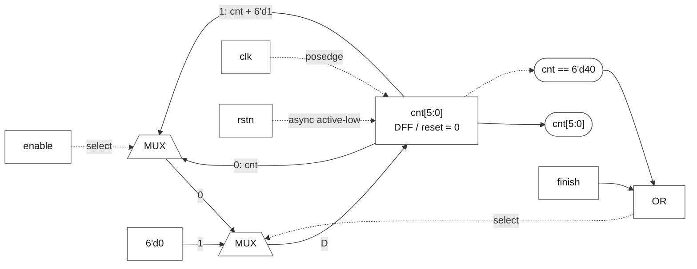

## blockcnt

Increment on enable AND cnt == 32 has priority over finish. Arithmetic wraps at 7 bits.

[SVG](fetch8x8_outputs/blockcnt.svg) · [Mermaid](fetch8x8_outputs/blockcnt.mmd)

Mermaid source and preview

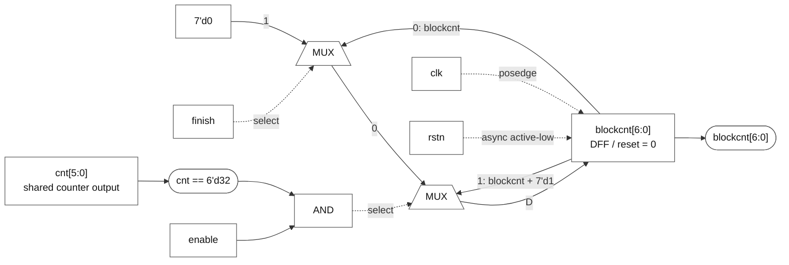

## rf_512bit

Upper lane captures at pre-edge cnt == 2; lower lane at cnt == 10. Capture is independent of enable and finish.

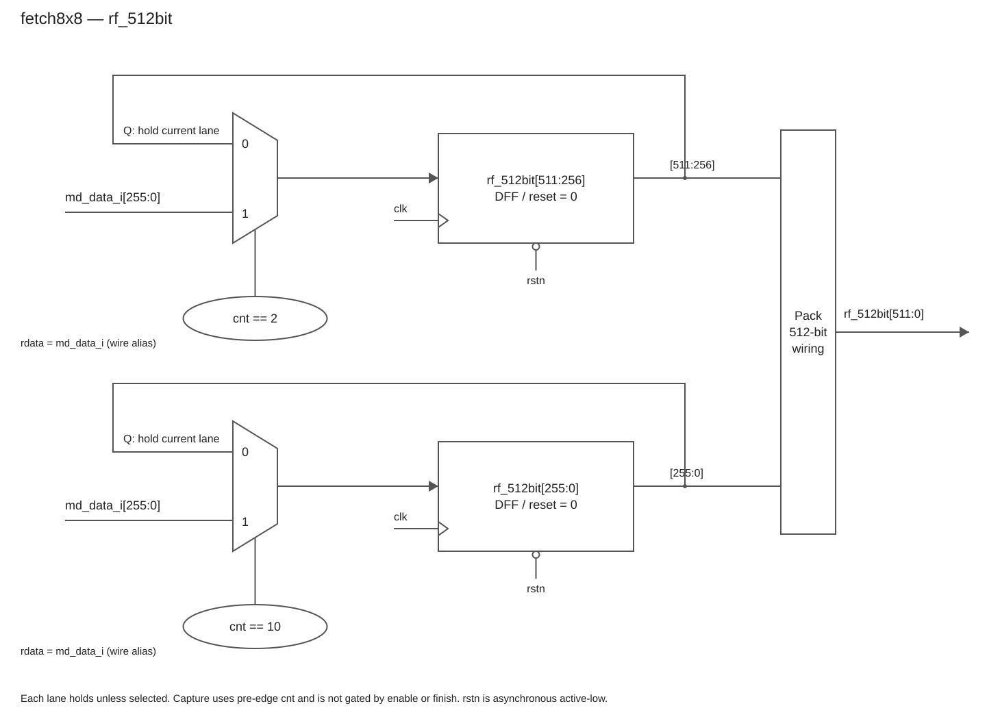

[SVG](fetch8x8_outputs/rf_512bit.svg) · [Mermaid](fetch8x8_outputs/rf_512bit.mmd)

Mermaid source and preview

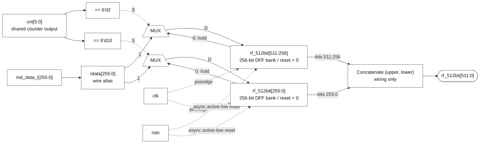

## md_ren_o

Set on cnt == 0 AND enable; else clear on cnt == 17; else hold.

[SVG](fetch8x8_outputs/md_ren_o.svg) · [Mermaid](fetch8x8_outputs/md_ren_o.mmd)

Mermaid source and preview

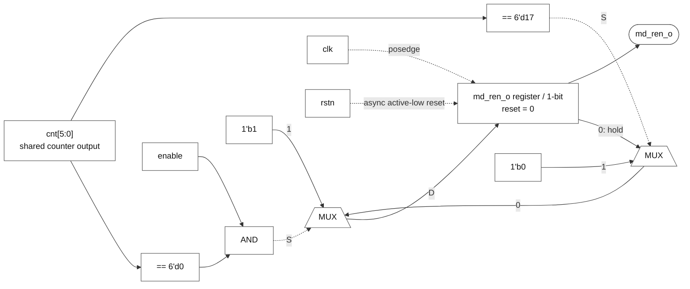

## md_sel_o

Constant 1'b0.

[SVG](fetch8x8_outputs/md_sel_o.svg) · [Mermaid](fetch8x8_outputs/md_sel_o.mmd)

Mermaid source and preview

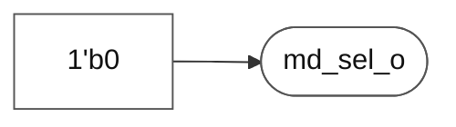

## md_size_o

Constant 2'b01.

[SVG](fetch8x8_outputs/md_size_o.svg) · [Mermaid](fetch8x8_outputs/md_size_o.mmd)

Mermaid source and preview

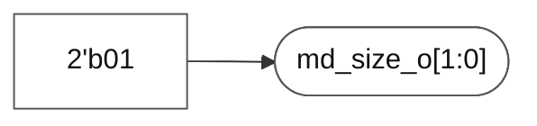

## md_4x4_x_o

{blockcnt[4], blockcnt[2], blockcnt[0], 1'b0}; wiring only.

[SVG](fetch8x8_outputs/md_4x4_x_o.svg) · [Mermaid](fetch8x8_outputs/md_4x4_x_o.mmd)

Mermaid source and preview

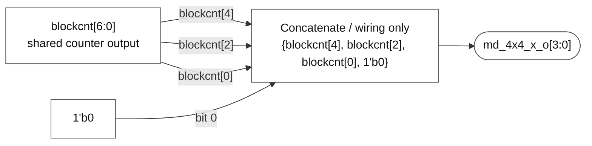

## md_4x4_y_o

{blockcnt[5], blockcnt[3], blockcnt[1], 1'b0}; wiring only.

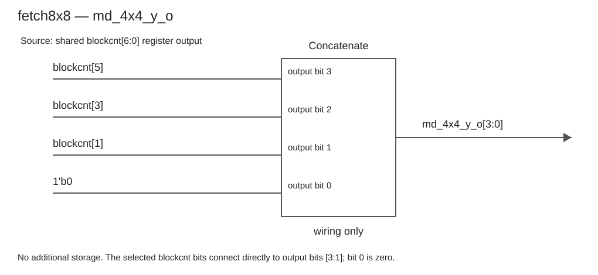

[SVG](fetch8x8_outputs/md_4x4_y_o.svg) · [Mermaid](fetch8x8_outputs/md_4x4_y_o.mmd)

Mermaid source and preview

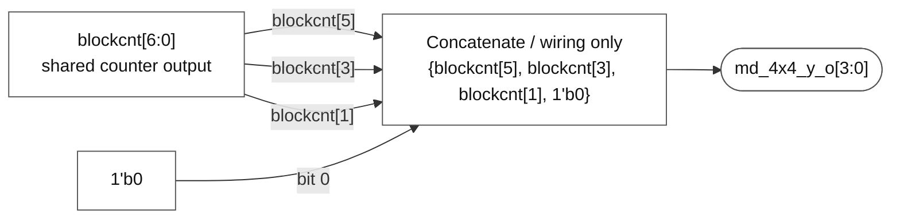

## md_idx_o

{2'b00, flag, 2'b00}; flag samples pre-edge cnt[3] every clock.

[SVG](fetch8x8_outputs/md_idx_o.svg) · [Mermaid](fetch8x8_outputs/md_idx_o.mmd)

Mermaid source and preview

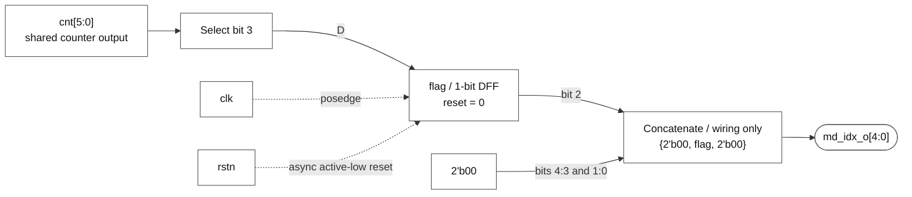

## Verification

All nine RTL outputs are covered. Mux branches, update priorities, pre-edge semantics, bit mappings, reset values and constants were checked against the supplied RTL. SVG files passed XML parsing.

The seven newly completed output schematics were rendered to PNG and visually reviewed; overlapping coordinate-pack labels were corrected. Mermaid source is provided without a rendered-layout validation.
