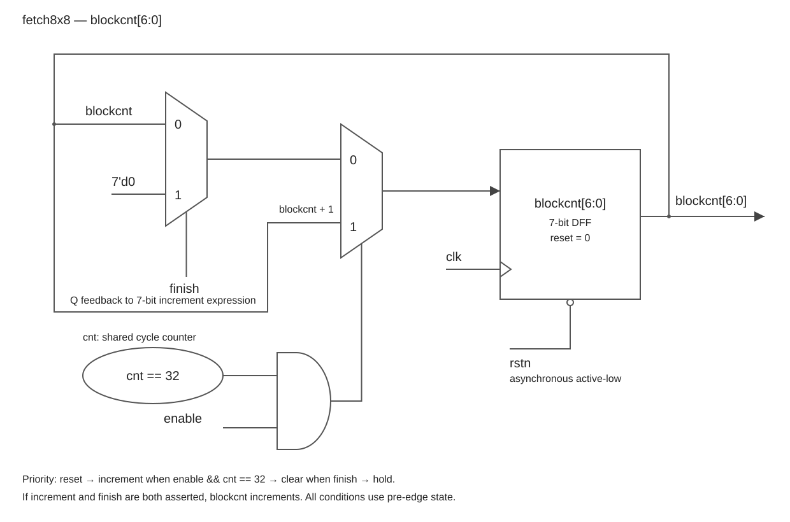
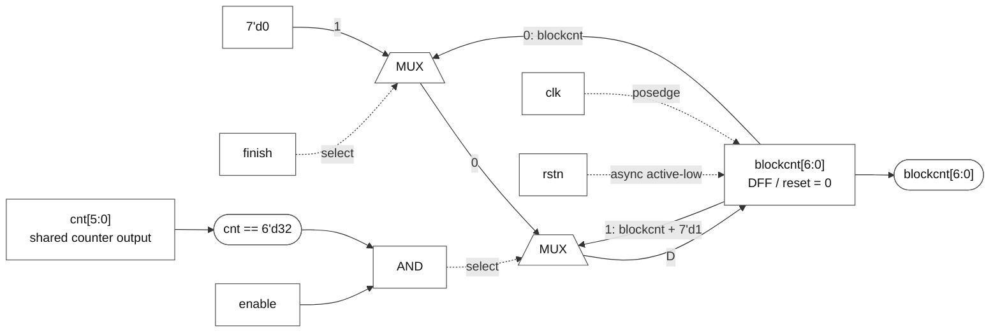

# blockcnt

Increment on enable AND cnt == 32 has priority over finish. Arithmetic wraps at 7 bits.

[SVG](blockcnt.svg) · [Mermaid](blockcnt.mmd)

Mermaid source and preview

```mermaid
%% blockcnt: clear/hold mux -> increment-priority mux -> register -> output.
%% blockcnt + 7'd1 denotes 7-bit combinational arithmetic on the feedback path.
%% Native Mermaid approximates mux geometry and automatically places nodes.
flowchart LR
  M1[/"MUX"\] -->|0| M2[/"MUX"\]
  M2 -->|D| Q["blockcnt[6:0]<br/>DFF / reset = 0"]
  Q --> OUT(["blockcnt[6:0]"])
  Q -->|"0: blockcnt"| M1
  ZERO["7'd0"] -->|1| M1
  FIN["finish"] -.->|select| M1
  Q -->|"1: blockcnt + 7'd1"| M2
  CNT["cnt[5:0]<br/>shared counter output"] --> CMP(["cnt == 6'd32"])
  CMP --> AND["AND"]
  EN["enable"] --> AND
  AND -.->|select| M2
  CLK["clk"] -.->|posedge| Q
  RST["rstn"] -.->|"async active-low"| Q
  classDef default fill:#fff,stroke:#555,color:#111;
```

