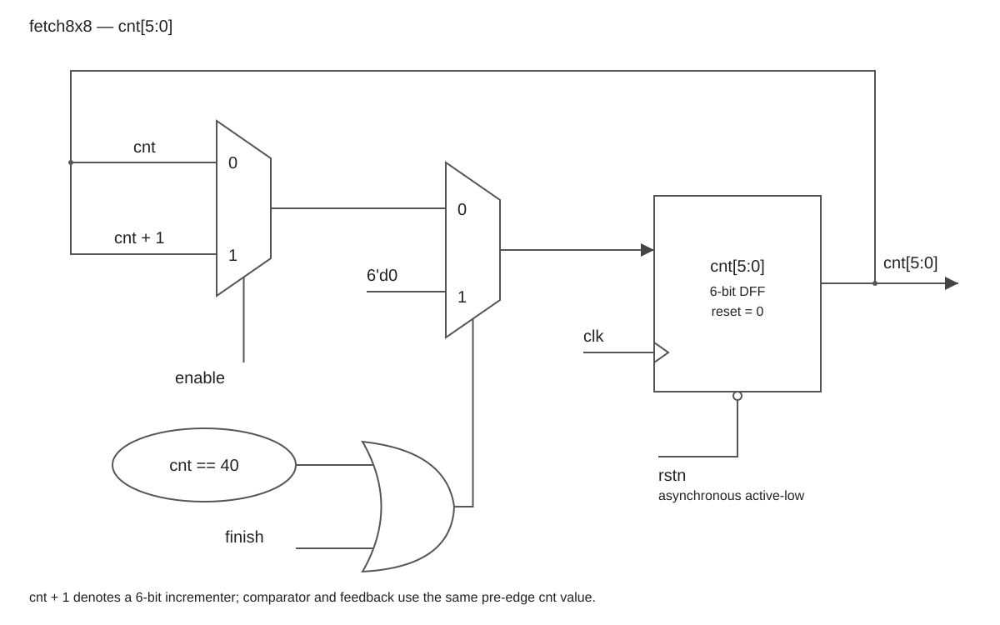
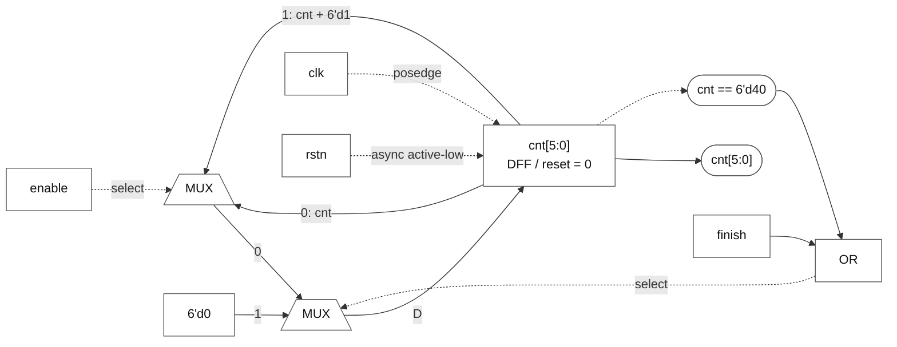

# cnt

Clear on cnt == 40 or finish has priority over increment. Otherwise enable selects increment versus hold.

[SVG](cnt.svg) · [Mermaid](cnt.mmd)

Mermaid source and preview

```mermaid
%% Main spine follows the user's schematic: update mux -> clear mux -> DFF -> output.
%% cnt + 1 on a feedback edge denotes 6-bit combinational arithmetic, not a wire alias.
%% Native Mermaid does not guarantee vertical mux geometry or fixed pin placement.
flowchart LR
  M1[/"MUX"\] -->|0| M2[/"MUX"\]
  M2 -->|D| Q["cnt[5:0]<br/>DFF / reset = 0"]
  Q --> OUT(["cnt[5:0]"])
  Q -->|"0: cnt"| M1
  Q -->|"1: cnt + 6'd1"| M1
  EN["enable"] -.->|select| M1
  ZERO["6'd0"] -->|1| M2
  Q -.-> CMP(["cnt == 6'd40"])
  CMP --> OR["OR"]
  FIN["finish"] --> OR
  OR -.->|select| M2
  CLK["clk"] -.->|posedge| Q
  RST["rstn"] -.->|"async active-low"| Q
  classDef default fill:#fff,stroke:#555,color:#111;
```

