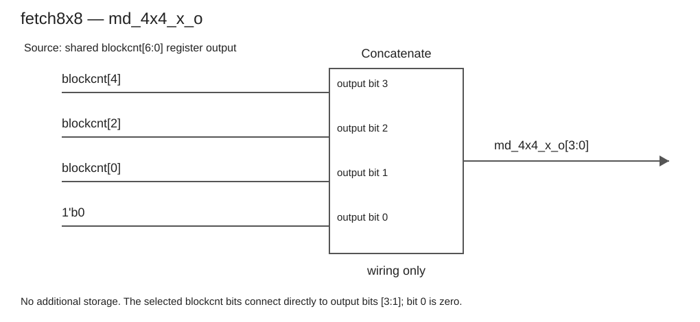
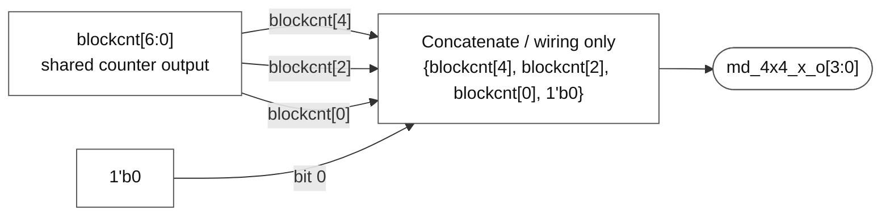

# md_4x4_x_o

{blockcnt[4], blockcnt[2], blockcnt[0], 1'b0}; wiring only.

[SVG](md_4x4_x_o.svg) · [Mermaid](md_4x4_x_o.mmd)

Mermaid source and preview

```mermaid
flowchart LR
B["blockcnt[6:0]<br/>shared counter output"] -->|"blockcnt[4]"| PACK["Concatenate / wiring only<br/>{blockcnt[4], blockcnt[2], blockcnt[0], 1'b0}"]
  B -->|"blockcnt[2]"| PACK
  B -->|"blockcnt[0]"| PACK
  ZERO["1'b0"] -->|"bit 0"| PACK
  PACK --> O(["md_4x4_x_o[3:0]"])
  classDef default fill:#fff,stroke:#555,color:#111;
```

