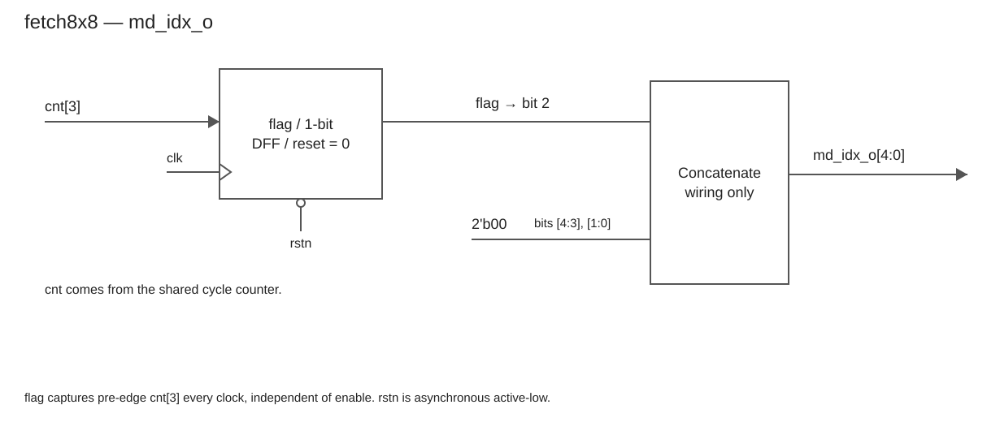
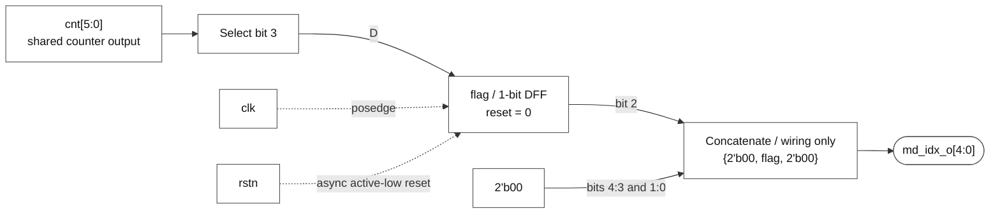

# md_idx_o

{2'b00, flag, 2'b00}; flag samples pre-edge cnt[3] every clock.

[SVG](md_idx_o.svg) · [Mermaid](md_idx_o.mmd)

Mermaid source and preview

```mermaid
flowchart LR
C["cnt[5:0]<br/>shared counter output"] --> SLICE["Select bit 3"]
  SLICE -->|D| F["flag / 1-bit DFF<br/>reset = 0"]
  F -->|"bit 2"| PACK["Concatenate / wiring only<br/>{2'b00, flag, 2'b00}"]
  ZERO["2'b00"] -->|"bits 4:3 and 1:0"| PACK
  PACK --> O(["md_idx_o[4:0]"])
  CLK["clk"] -.->|posedge| F
  RST["rstn"] -.->|"async active-low reset"| F
  classDef default fill:#fff,stroke:#555,color:#111;
```

