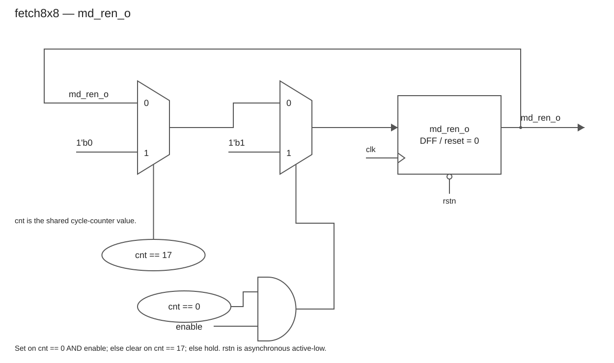
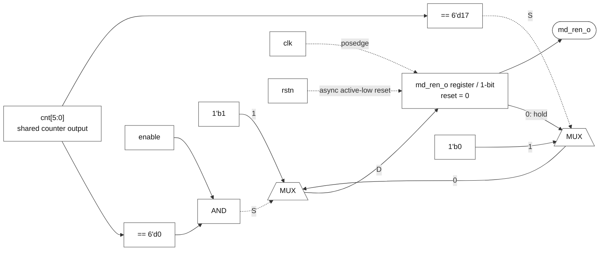

# md_ren_o

Set on cnt == 0 AND enable; else clear on cnt == 17; else hold.

[SVG](md_ren_o.svg) · [Mermaid](md_ren_o.mmd)

Mermaid source and preview

```mermaid
flowchart LR
C["cnt[5:0]<br/>shared counter output"] --> E0["== 6'd0"]
  C --> E17["== 6'd17"]
  E0 --> AND["AND"]
  EN["enable"] --> AND
  Q["md_ren_o register / 1-bit<br/>reset = 0"] -->|"0: hold"| CM[/"MUX"\]
  ZERO["1'b0"] -->|1| CM
  E17 -.->|S| CM
  CM -->|0| SM[/"MUX"\]
  ONE["1'b1"] -->|1| SM
  AND -.->|S| SM
  SM -->|D| Q
  Q --> O(["md_ren_o"])
  CLK["clk"] -.->|posedge| Q
  RST["rstn"] -.->|"async active-low reset"| Q
  classDef default fill:#fff,stroke:#555,color:#111;
```

