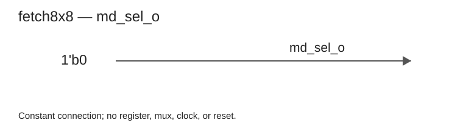
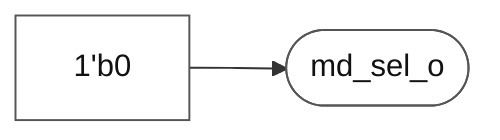

# md_sel_o

Constant 1'b0.

[SVG](md_sel_o.svg) · [Mermaid](md_sel_o.mmd)

Mermaid source and preview

```mermaid
flowchart LR
CONST["1'b0"] --> O(["md_sel_o"])
  classDef default fill:#fff,stroke:#555,color:#111;
```

