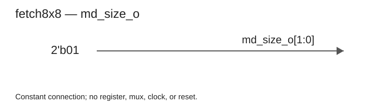
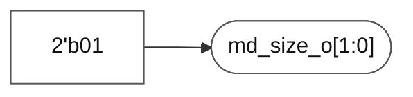

# md_size_o

Constant 2'b01.

[SVG](md_size_o.svg) · [Mermaid](md_size_o.mmd)

Mermaid source and preview

```mermaid
flowchart LR
CONST["2'b01"] --> O(["md_size_o[1:0]"])
  classDef default fill:#fff,stroke:#555,color:#111;
```

