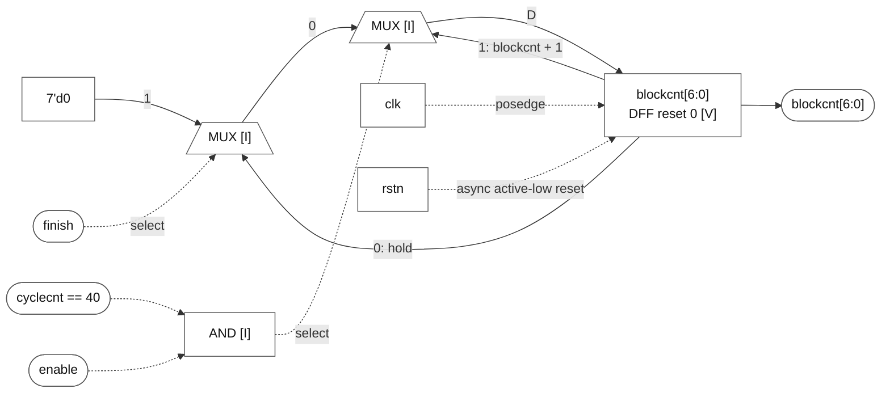

# blockcnt[6:0]

### blockcnt[6:0]

**Block:** `blockcnt[6:0]` update path. **Status:** register and behavior VERIFIED; mux/gate realization INFERRED. **RTL evidence:** [control.v:63](/home/windyphony/projects/xk265/rtl/prei/control.v:63), lines 63–69. **Evidence:** `if (!rstn) 0; else if (enable && cyclecnt == 40) blockcnt + 1; else if (finish) 0; else hold.`

![blockcnt[6:0]](blockcnt.svg)

[SVG](blockcnt.svg) · [PNG](blockcnt.png) · [Mermaid](blockcnt.mmd)

Mermaid source and preview

