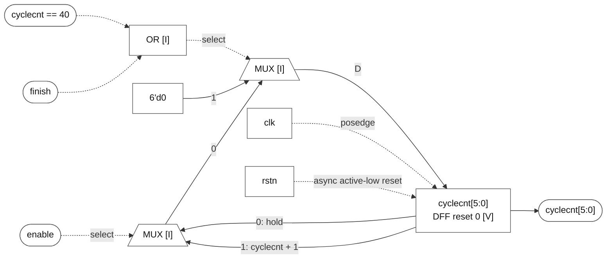
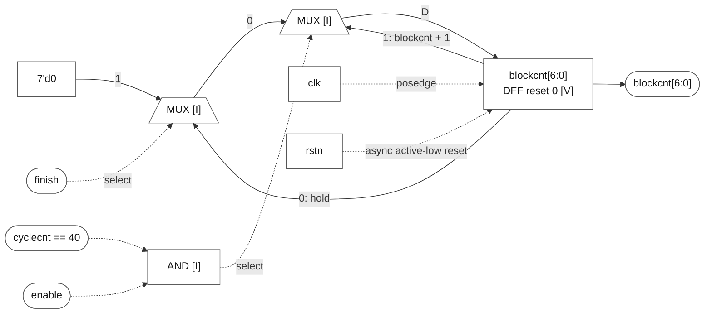
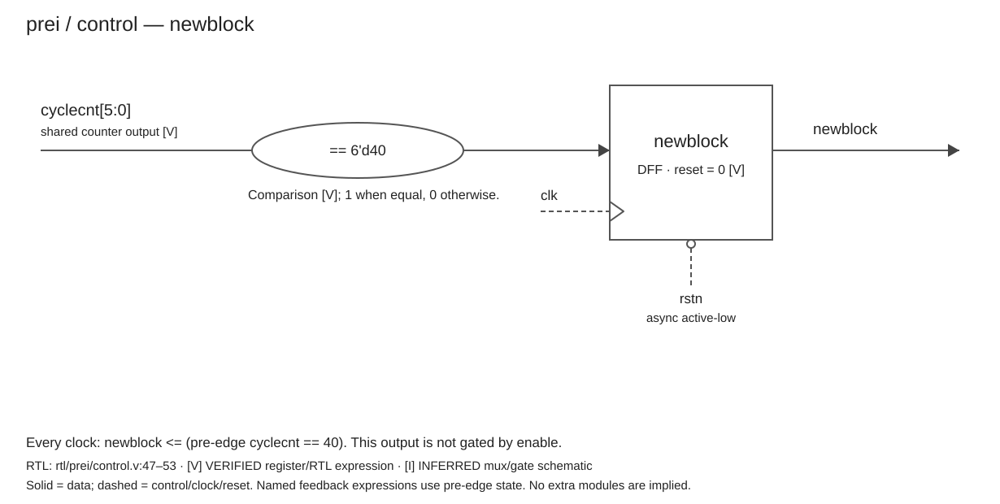
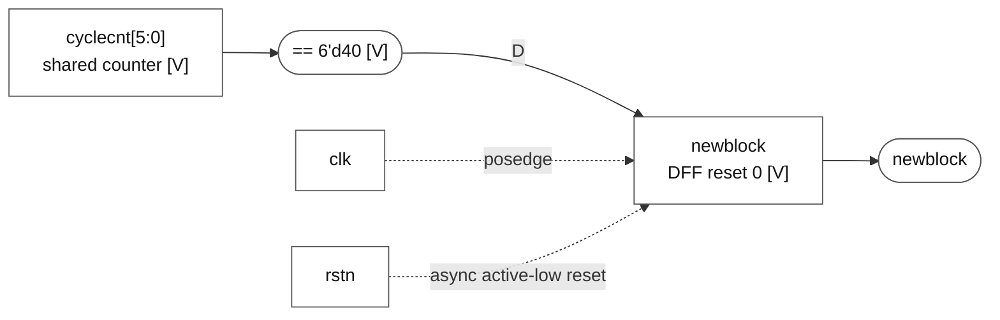
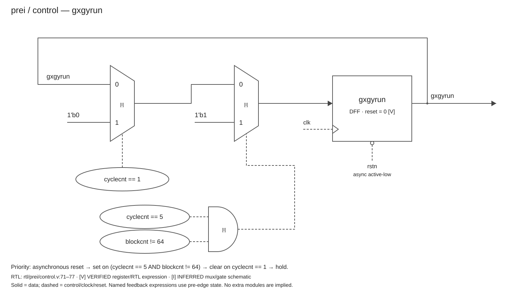
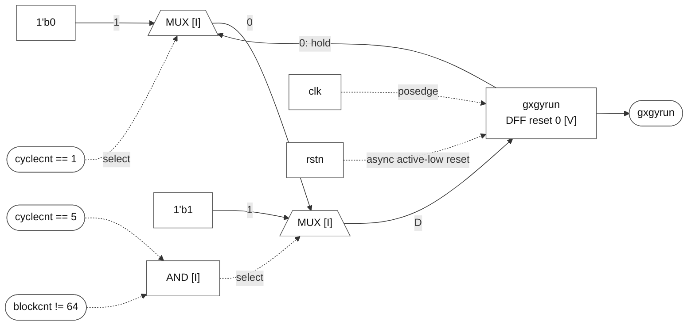
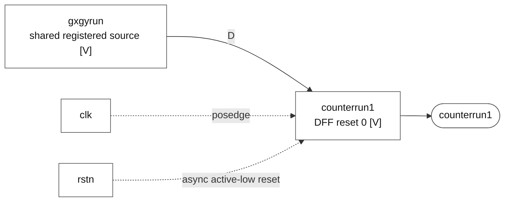
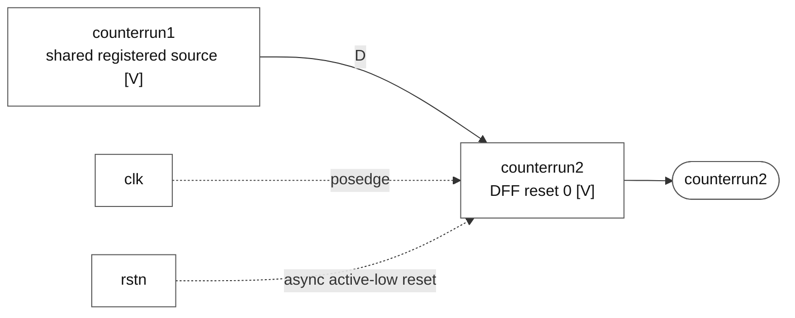
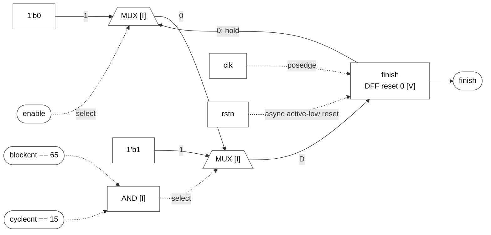

# prei / control.v — microarchitecture

Source: [control.v](/home/windyphony/projects/xk265/rtl/prei/control.v:11). SHA-256: `e3dcb5d87a4c6f68682577da85168c5387effa7d5cfb89d1bd6d976ce3885230`. Scope: the single `control` module, with one diagram per output. RTL was not modified.

## Conventions

- **VERIFIED [V]**: ports, widths, state registers, update expressions, comparisons, clock/reset and actual parent connectivity directly present in RTL.
- **INFERRED [I]**: muxes, incrementer expressions on feedback branches, AND/OR gates and the DFF schematic realization express RTL behavior; they are not named child modules or a synthesis netlist.
- **UNKNOWN**: unused undriven `tid_o[2:0]` has no specified value or function; see audit below.
- Solid lines carry data; dashed lines carry control, clock or reset. Named predicates refer to the same shared state, not duplicated registers. All update conditions and RHS expressions use **pre-edge values**.
- SVG/PNG follow the approved drawing form. Mermaid files preserve logic but use automatic layout and approximate mux shapes.

## Hierarchy and interface

**Block:** `control` / **Status:** VERIFIED. **RTL evidence:** `rtl/prei/control.v:11–99` declares a leaf module with no module instances, memories, parameters, includes or generate constructs. Actual parent instance: [md_top.v:113](/home/windyphony/projects/xk265/rtl/prei/md_top.v:113), `control control1`, lines 113–125. The child's `cyclecnt` port connects to parent net `cnt`; the other ports retain matching parent signal names.

| Direction | Ports | Width | Evidence |
|---|---|---|---|
| Input | `clk`, `rstn`, `enable` | 1 each | lines 24–27 |
| Output | `cyclecnt` | 6 | lines 28, 42 |
| Output | `blockcnt` | 7 | lines 29, 43 |
| Output | `newblock`, `gxgyrun`, `counterrun1`, `counterrun2`, `finish` | 1 each | lines 30–40 |

**Clock/reset [V]:** every driven register uses `posedge clk or negedge rstn`; reset is asynchronous active-low and clears all seven driven registers to zero. The module contains 18 driven state bits (6 + 7 + 5).

**FSM/memory [V]:** no explicit state-machine case/state encoding, no memory array, and no memory instance. This is counter/condition-based control; do not invent an FSM module or a RAM.

**Registered control delays [V]:** `gxgyrun → counterrun1 → counterrun2`, with no intervening combinational operation beyond connection. Each arrow crosses one rising-edge register boundary. Relative to the registered `gxgyrun` output, the delays are one and two clocks. These are control delays, not evidence of an independent processing datapath pipeline.

## Output diagrams

### cyclecnt[5:0]

**Block:** `cyclecnt[5:0]` update path. **Status:** register and behavior VERIFIED; mux/gate realization INFERRED. **RTL evidence:** [control.v:55](/home/windyphony/projects/xk265/rtl/prei/control.v:55), lines 55–61. **Evidence:** `if (!rstn) 0; else if (cyclecnt == 40 || finish) 0; else if (enable) cyclecnt + 1; else hold.`

![cyclecnt[5:0]](cyclecnt.svg)

[SVG](cyclecnt.svg) · [PNG](cyclecnt.png) · [Mermaid](cyclecnt.mmd)

Mermaid source and preview

### blockcnt[6:0]

**Block:** `blockcnt[6:0]` update path. **Status:** register and behavior VERIFIED; mux/gate realization INFERRED. **RTL evidence:** [control.v:63](/home/windyphony/projects/xk265/rtl/prei/control.v:63), lines 63–69. **Evidence:** `if (!rstn) 0; else if (enable && cyclecnt == 40) blockcnt + 1; else if (finish) 0; else hold.`

![blockcnt[6:0]](blockcnt.svg)

[SVG](blockcnt.svg) · [PNG](blockcnt.png) · [Mermaid](blockcnt.mmd)

Mermaid source and preview

### newblock

**Block:** `newblock` update path. **Status:** register and behavior VERIFIED; mux/gate realization INFERRED. **RTL evidence:** [control.v:47](/home/windyphony/projects/xk265/rtl/prei/control.v:47), lines 47–53. **Evidence:** `if (!rstn) 0; else (cyclecnt == 40).`

[SVG](newblock.svg) · [PNG](newblock.png) · [Mermaid](newblock.mmd)

Mermaid source and preview

### gxgyrun

**Block:** `gxgyrun` update path. **Status:** register and behavior VERIFIED; mux/gate realization INFERRED. **RTL evidence:** [control.v:71](/home/windyphony/projects/xk265/rtl/prei/control.v:71), lines 71–77. **Evidence:** `if (!rstn) 0; else if (cyclecnt == 5 && blockcnt != 64) 1; else if (cyclecnt == 1) 0; else hold.`

[SVG](gxgyrun.svg) · [PNG](gxgyrun.png) · [Mermaid](gxgyrun.mmd)

Mermaid source and preview

### counterrun1

**Block:** `counterrun1` update path. **Status:** register and behavior VERIFIED; mux/gate realization INFERRED. **RTL evidence:** [control.v:79](/home/windyphony/projects/xk265/rtl/prei/control.v:79), lines 79–83. **Evidence:** `if (!rstn) 0; else gxgyrun.`

[SVG](counterrun1.svg) · [PNG](counterrun1.png) · [Mermaid](counterrun1.mmd)

Mermaid source and preview

### counterrun2

**Block:** `counterrun2` update path. **Status:** register and behavior VERIFIED; mux/gate realization INFERRED. **RTL evidence:** [control.v:85](/home/windyphony/projects/xk265/rtl/prei/control.v:85), lines 85–89. **Evidence:** `if (!rstn) 0; else counterrun1.`

[SVG](counterrun2.svg) · [PNG](counterrun2.png) · [Mermaid](counterrun2.mmd)

Mermaid source and preview

### finish

**Block:** `finish` update path. **Status:** register and behavior VERIFIED; mux/gate realization INFERRED. **RTL evidence:** [control.v:91](/home/windyphony/projects/xk265/rtl/prei/control.v:91), lines 91–97. **Evidence:** `if (!rstn) 0; else if (blockcnt == 65 && cyclecnt == 15) 1; else if (enable) 0; else hold.`

[SVG](finish.svg) · [PNG](finish.png) · [Mermaid](finish.mmd)

Mermaid source and preview

## Behavioral details

- `blockcnt` increments at **cyclecnt == 40**, unlike the earlier fetch8x8 example at 32. Increment wins over `finish` when both conditions hold.
- `finish` set has priority over clear by `enable`. If neither set nor clear condition is true, it holds its prior value. Therefore `finish` is not guaranteed to be a one-clock pulse when enable is low.
- When `finish` is first set, `cyclecnt` still uses the previous finish value on that edge. Its clear from the new finish value occurs on a subsequent edge.
- `newblock` registers the comparison every clock. It is not gated by enable; a cyclecnt value of 40 clears cyclecnt independently of enable.
- `gxgyrun` set requires blockcnt != 64. This does not force gxgyrun low whenever blockcnt equals 64: clear still requires cyclecnt == 1, otherwise it holds.
- Both run-delay registers update on every clock, independently of enable. Counter arithmetic is unsigned and wraps to the declared destination width.

## Verification checklist

- [x] Module hierarchy verified: leaf control and direct parent control1 connection.
- [x] Module instantiations verified: none inside control.
- [x] Port directions verified against declarations and parent connection.
- [x] Signal widths verified: no unresolved width parameters/macros.
- [x] Major signal connections verified against assignments and parent instance.
- [x] Memories/buffers verified: none present in this module.
- [x] FSMs verified: no explicit FSM implementation present.
- [x] Sequential registers verified: seven driven registers; tid_o declared but undriven/unused.
- [x] Pipeline boundaries verified: two specified control-register delays; no separate processing pipeline inferred.
- [x] Datapath verified: two increment paths and register input selection.
- [x] Control path verified: conditions, priority, hold, and registered delay behavior.
- [x] Clock/reset domains verified: one clock and asynchronous active-low reset.

## Completeness and uncertainty audit

1. **RTL blocks missing from diagrams:** only `reg [2:0] tid_o` (line 45), deliberately omitted from functional diagrams because it has no driver or use; documented here. Every output-driving always block is covered.
2. **Diagram blocks without direct structural RTL instances:** mux, gate, incrementer and DFF symbols are inferred realizations of explicit expressions/processes, labeled [I] where appropriate. No invented child module is claimed.
3. **Missing or uncertain connections:** none in the seven output paths. Cross-diagram predicates use named shared registers. tid_o has no connections.
4. **Uncertain signal directions:** none.
5. **Uncertain signal widths:** none.
6. **Unresolved hierarchy:** none within the control module and its verified direct parent connection; broader encoder hierarchy is outside scope.
7. **Unresolved pipeline stages:** none claimed; external processing latency is outside scope.
8. **Unresolved memory implementation:** none; no memory is present.
9. **Unresolved FSM behavior:** none; no explicit FSM exists.
10. **Other UNKNOWN items:** intended purpose/value of tid_o; optimized physical mux/gate topology and timing constraints are not specified by this RTL. The diagrams are RTL behavioral structure, not a post-synthesis netlist.

## Artifact validation

All seven SVGs were rendered to PNG and visually reviewed for connections, labels, clipping and overlap. SVG XML and local artifact links were checked. The source RTL SHA-256 still matches the captured version. Mermaid files are supplied as editable logic diagrams; their rendered layouts were not validated. No RTL simulation or synthesis was run for this documentation-only task.
