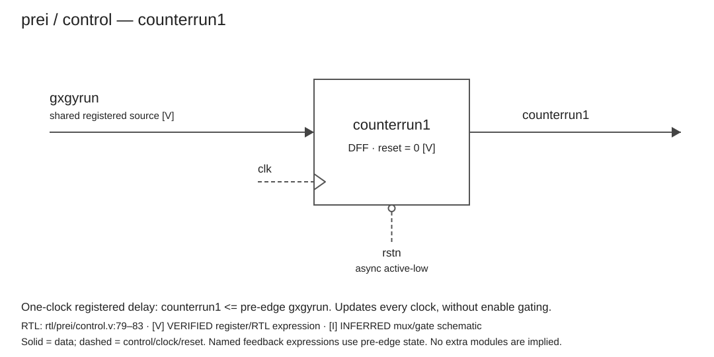
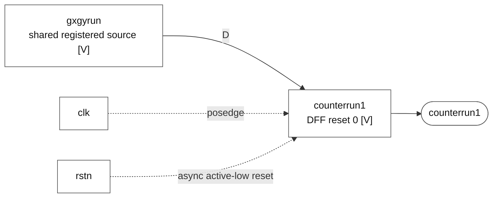

# counterrun1

### counterrun1

**Block:** `counterrun1` update path. **Status:** register and behavior VERIFIED; mux/gate realization INFERRED. **RTL evidence:** [control.v:79](/home/windyphony/projects/xk265/rtl/prei/control.v:79), lines 79–83. **Evidence:** `if (!rstn) 0; else gxgyrun.`

[SVG](counterrun1.svg) · [PNG](counterrun1.png) · [Mermaid](counterrun1.mmd)

Mermaid source and preview

