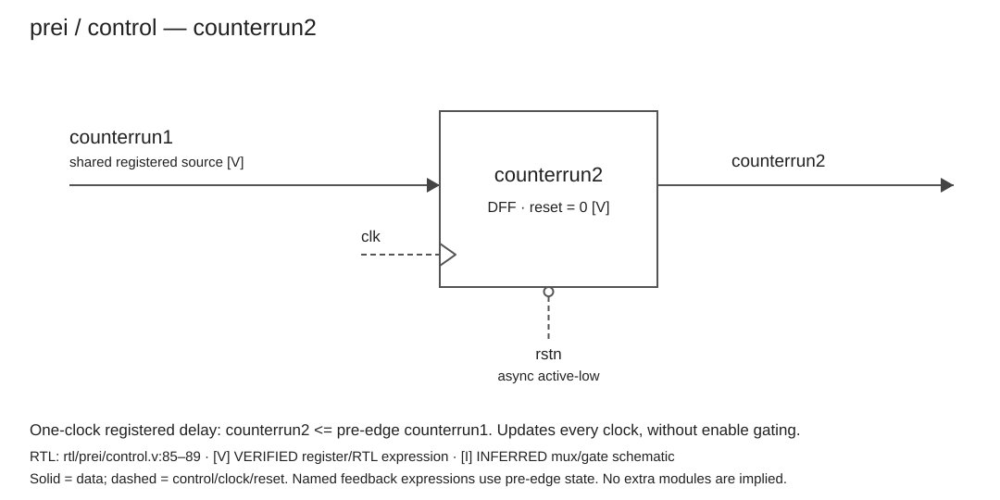
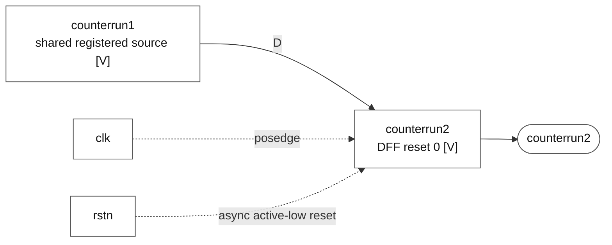

# counterrun2

### counterrun2

**Block:** `counterrun2` update path. **Status:** register and behavior VERIFIED; mux/gate realization INFERRED. **RTL evidence:** [control.v:85](/home/windyphony/projects/xk265/rtl/prei/control.v:85), lines 85–89. **Evidence:** `if (!rstn) 0; else counterrun1.`

[SVG](counterrun2.svg) · [PNG](counterrun2.png) · [Mermaid](counterrun2.mmd)

Mermaid source and preview

