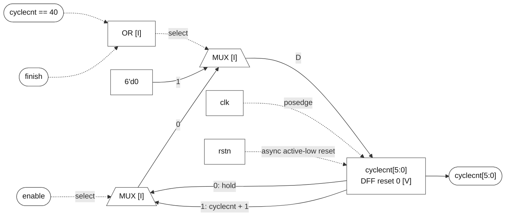

# cyclecnt[5:0]

### cyclecnt[5:0]

**Block:** `cyclecnt[5:0]` update path. **Status:** register and behavior VERIFIED; mux/gate realization INFERRED. **RTL evidence:** [control.v:55](/home/windyphony/projects/xk265/rtl/prei/control.v:55), lines 55–61. **Evidence:** `if (!rstn) 0; else if (cyclecnt == 40 || finish) 0; else if (enable) cyclecnt + 1; else hold.`

![cyclecnt[5:0]](cyclecnt.svg)

[SVG](cyclecnt.svg) · [PNG](cyclecnt.png) · [Mermaid](cyclecnt.mmd)

Mermaid source and preview

