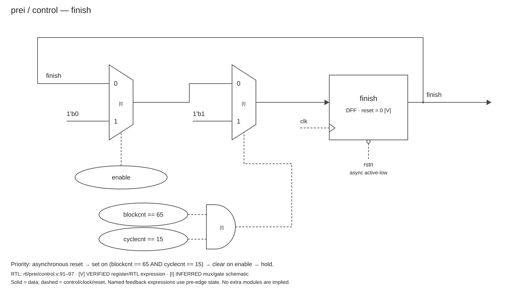
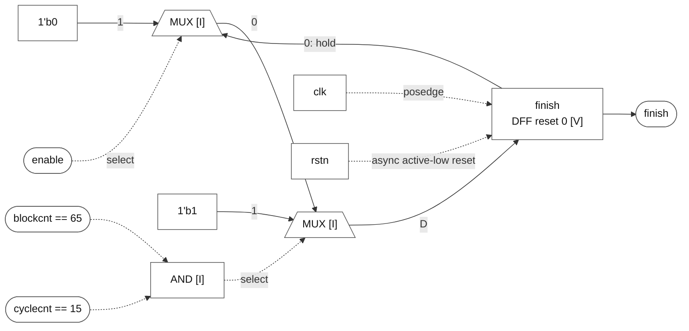

# finish

### finish

**Block:** `finish` update path. **Status:** register and behavior VERIFIED; mux/gate realization INFERRED. **RTL evidence:** [control.v:91](/home/windyphony/projects/xk265/rtl/prei/control.v:91), lines 91–97. **Evidence:** `if (!rstn) 0; else if (blockcnt == 65 && cyclecnt == 15) 1; else if (enable) 0; else hold.`

[SVG](finish.svg) · [PNG](finish.png) · [Mermaid](finish.mmd)

Mermaid source and preview

