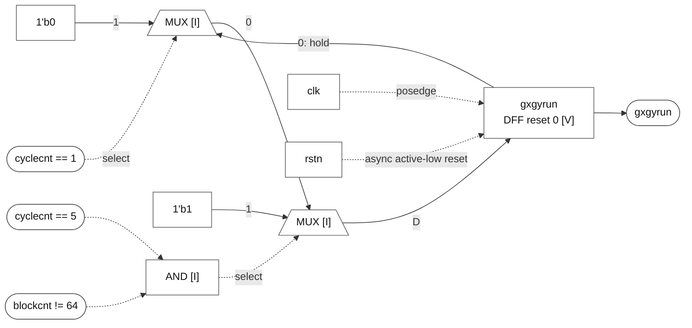

# gxgyrun

### gxgyrun

**Block:** `gxgyrun` update path. **Status:** register and behavior VERIFIED; mux/gate realization INFERRED. **RTL evidence:** [control.v:71](/home/windyphony/projects/xk265/rtl/prei/control.v:71), lines 71–77. **Evidence:** `if (!rstn) 0; else if (cyclecnt == 5 && blockcnt != 64) 1; else if (cyclecnt == 1) 0; else hold.`

[SVG](gxgyrun.svg) · [PNG](gxgyrun.png) · [Mermaid](gxgyrun.mmd)

Mermaid source and preview

