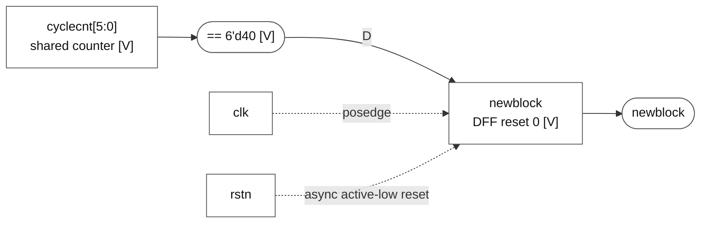

# newblock

### newblock

**Block:** `newblock` update path. **Status:** register and behavior VERIFIED; mux/gate realization INFERRED. **RTL evidence:** [control.v:47](/home/windyphony/projects/xk265/rtl/prei/control.v:47), lines 47–53. **Evidence:** `if (!rstn) 0; else (cyclecnt == 40).`

[SVG](newblock.svg) · [PNG](newblock.png) · [Mermaid](newblock.mmd)

Mermaid source and preview

