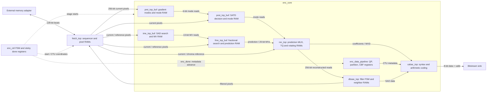
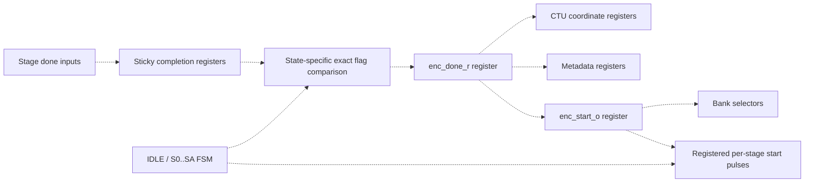
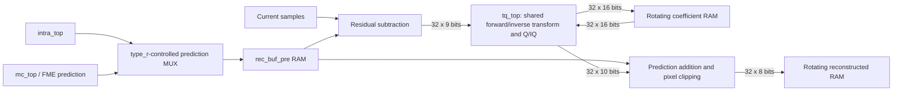

# xk265 Microarchitecture Specification

## 1. Scope and Evidence

This document describes the implemented xk265 RTL for hardware designers and verification engineers. It specifies existing behavior, not a proposed redesign or an HEVC conformance guarantee. The evidence baseline is the working-tree RTL inspected on 2026-09-10, including local changes; it is not a released netlist.

References link to repository sources with line anchors. `INFERRED` identifies a deduction or integration constraint; `UNKNOWN` identifies behavior not established by this inspection. Widths use the checked-in macros and default module parameters. Existing [architecture notes](../rtl/docs/architecture/00_repository_map.md) provide supplementary material but are not the authority when they disagree with RTL.

### 1.1 Design Envelope

| Property | Implemented definition | Evidence |
|---|---|---|
| Design top | `h265enc_top`; children `enc_ctrl`, `fetch_top`, `enc_core` | [enc_top.v](../rtl/top/enc_top.v#L32) |
| Clock/reset | `clk`; top control registers use rising clock edge and asynchronous active-low `rstn` | [enc_ctrl.v](../rtl/top/enc_ctrl.v#L265) |
| CTU/LCU | 64x64 luma pixels; CU depth 3, down to 8x8 | [enc_defines.v](../rtl/enc_defines.v#L84) |
| Sample/coefficient widths | 8-bit pixels, 16-bit coefficient storage | [enc_defines.v](../rtl/enc_defines.v#L106) |
| Frame type | Top-level `0=INTRA`, `1=INTER`; CABAC receives inverted slice type | [enc_core.v](../rtl/top/enc_core.v#L905) |
| Motion vectors | IME packed X/Y: 7+6 bits; FME X/Y: 10 bits each; MVD components: 11 bits | [enc_defines.v](../rtl/enc_defines.v#L45) |
| Cost widths | IME 28 bits; POSI/FME aggregate cost macros 20 bits | [enc_defines.v](../rtl/enc_defines.v#L36) |
| Formats | Testbench implements 8-bit YUV 4:2:0 storage; chroma transfers use mode-dependent packing | [tb_enc_top.v](../sim/top_testbench/tb_enc_top.v#L23) |
| Features | Intra/inter estimation, optional intra selection in P, skip candidates, reconstruction, DB/SAO hardware, CABAC | [enc_core.v](../rtl/top/enc_core.v#L512) |

The RTL exposes only a one-bit frame type and one reference-fetch path. B pictures, multiple reference lists, other chroma formats, and higher sample depths are not established supported configurations. Frequency, area, power, profile/level compliance, and maximum validated picture size are `UNKNOWN`.

Picture dimensions are pixel counts. The top computes `ceil(dimension/64)-1` into six-bit CTU fields, so `sys_ctu_all_*` are **last CTU indices**, not counts. The coordinate capacity is 64 CTUs per axis; that is not a verified resolution limit. The core derives residual CTU coordinates as `sys_all_*[5:2]-1`, while CABAC receives `[5:0]` remainders. `INFERRED`: use nonzero dimensions aligned to four pixels until other sizes are verified; do not assume arbitrary dimensions or tiny pictures are safe. [Dimension conversion](../rtl/top/enc_top.v#L329), [residual coordinates](../rtl/top/enc_core.v#L503).

## 2. Hierarchy and Data Flow

`enc_core` instantiates `prei_top_buf`, `ime_top_buf`, `posi_top_buf`, `fme_top_buf`, `rec_top`, `dbsao_top`, `cabac_top`, and `enc_data_pipeline`. FETCH is a sibling of the core, not a core child. PREI/IME share one scheduling stage; POSI/FME share the next. [Core integration](../rtl/top/enc_core.v#L512).

The following diagram is a functional view across those hierarchy boundaries. Solid arrows carry data; dashed arrows carry control. Memory and metadata registers are explicit; arrows do not imply same-cycle transfers.



## 3. Global Scheduling and Control

### 3.1 Barrier-Driven Pipeline

`enc_ctrl` has 12 states: `IDLE`, `S0` through `S9`, and `SA`. It fills the active stages, stays in `S5` until the preload coordinates reach the last CTU, then drains. These are scheduling states, not individual clock cycles. [State transitions](../rtl/top/enc_ctrl.v#L287).

| State | Preload | PREI / IME | POSI / FME | REC | DB | CABAC / store |
|---|---|---|---|---|---|---|
| S0 | Yes | - | - | - | - | - |
| S1 | Yes | Yes | - | - | - | - |
| S2 | Yes | Yes | Yes | - | - | - |
| S3 | Yes | Yes | Yes | Yes | - | - |
| S4 | Yes | Yes | Yes | Yes | Yes | - |
| S5 | Yes | Yes | Yes | Yes | Yes | Yes |
| S6 | - | Yes | Yes | Yes | Yes | Yes |
| S7 | - | - | Yes | Yes | Yes | Yes |
| S8 | - | - | - | Yes | Yes | Yes |
| S9 | - | - | - | - | Yes | Yes |
| SA | - | - | - | - | - | Yes |

This table is the enable decode, not a promise that every enabled operation is meaningful for every picture size. IME/FME are disabled for INTRA; PREI/POSI remain enabled for INTER, even when intra-in-P selection is disabled. DB remains a scheduled stage when filtering is disabled. [Enable decode](../rtl/top/enc_ctrl.v#L318).

Each `*_done_i` is latched in a sticky flag until `enc_done_r` or IDLE clears it. For INTER, stage 1 needs both PREI and IME; stage 2 needs both POSI and FME. The controller compares the **entire six-bit flag vector** against a state-specific pattern, including zeros for inactive stages. Unexpected done pulses from inactive blocks can therefore prevent progression. [Completion logic](../rtl/top/enc_ctrl.v#L427).

On completion, CTU coordinates and metadata shift. Preload advances X first, wraps at the last X index, then advances Y. CABAC and store coordinates follow DB. FETCH also loads current chroma during stage 2 and top boundary pixels during REC; its completion remains part of the drain barrier. Stores at X=0 are suppressed; the fetch sequencer repeats the store pair at the row end. [Coordinate pipeline](../rtl/top/enc_ctrl.v#L497), [store sequencing](../rtl/fetch/fetch_wrapper.v#L340).



If all required flags are visible before edge A, `enc_done_r` asserts after A. At edge B, coordinates/metadata advance and `enc_start_o` captures the restart request. At edge C, stage-start registers capture the enable mask and the core bank selectors rotate. Synchronous consumers sample those starts on the following edge. For final `SA`, `enc_start_w` is forced low; `sys_done_o` indicates the `SA -> IDLE` transition instead. [Start registration](../rtl/top/enc_ctrl.v#L250), [stage starts](../rtl/top/enc_ctrl.v#L391).

### 3.2 Metadata Ownership

`enc_data_pipeline` updates on `enc_done_i`, not on arbitrary clock cycles. It carries the following CTU-associated state. [Declarations and shifts](../rtl/top/enc_data_pipeline.v#L59).

| Payload | Width | Route |
|---|---|---|
| QP | 6 | RC -> POSI/FME -> REC -> DB -> CABAC |
| Intra partition | 85 | POSI -> REC -> DB register -> CABAC; DB consumes low 21 bits |
| Inter partition | 42 | IME -> FME -> REC -> DB -> CABAC |
| I-in-P flags | 3 | REC -> DB -> CABAC |
| CBF | 256 each Y/U/V | REC -> DB -> CABAC |
| Skip flags / indices | 85 / 340 | FME -> registered REC/CABAC paths |

The 256 CBF positions correspond to the CTU's 4x4 grid; they must not be described as 256 distinct 8x8 blocks. [DB input comments](../rtl/db/dbsao_top.v#L117).

## 4. External Interface Contract

### 4.1 Configuration Ports

All directions below are relative to `h265enc_top`. There is no configuration bus or ready/busy register interface. `INFERRED`: hold configuration stable from start through processing and output drain, since many fields feed logic directly rather than a frame snapshot. Pulse `sys_start_i` for one cycle while idle; overlapping frame requests are not queued. [Top ports](../rtl/top/enc_top.v#L103).

| Port/group | Direction, bits | Meaning |
|---|---|---|
| `clk`, `rstn` | I, 1 each | Clock and active-low reset |
| `sys_start_i`, `sys_done_o` | I / O, 1 | Frame launch / scheduling completion |
| `sys_all_x_i`, `sys_all_y_i` | I, 13 / 12 | Pixel dimensions; internal CTU indices are narrower |
| `sys_type_i`, `sys_init_qp_i` | I, 1 / 6 | Frame type and initial QP; macro `INIT_QP=22` is not a latched top default |
| `sys_IinP_ena_i`, `sys_db_ena_i`, `sys_sao_ena_i` | I, 1 each | Reconstruction mode selection and filter controls |
| `sys_posi4x4bit_i` | I, 5 | POSI 4x4 rate-cost configuration |
| `skip_cost_thresh_08/16/32/64` | I, 32 each | Size-dependent skip cost thresholds |
| `sys_ime_cmd_num_i`, `sys_ime_cmd_dat_i` | I, 3 / 232 | Last command index and eight packed 29-bit commands |
| `sys_rc_mod64_sum_o`, `sys_rc_bitnum_i` | O / I, 32 | Complexity output / target feedback configuration |
| `sys_rc_k` | I, 16 | Rate-control coefficient |
| `sys_rc_roi_height`, `sys_rc_roi_width` | I, 6 / 7 | ROI extent fields |
| `sys_rc_roi_x`, `sys_rc_roi_y`, `sys_rc_roi_enable` | I, 7 / 7 / 1 | ROI location and enable |
| `sys_rc_L1_frame_byte`, `sys_rc_L2_frame_byte` | I, 10 each | Rate-control thresholds |
| `sys_rc_lcu_en` | I, 1 | LCU rate-control enable |
| `sys_rc_max_qp`, `sys_rc_min_qp`, `sys_rc_delta_qp` | I, 6 each | QP limits and ROI adjustment |

IME command zero occupies bits `[28:0]`; subsequent words are shifted by 29 bits. Within each word, MSB to LSB is `center_x[6:0]`, `center_y[5:0]`, `length_x[5:0]`, `length_y[4:0]`, `slope[1:0]`, `downsample`, `partition`, `use_feedback`. The command counter starts at zero and stops on equality with `cmd_num_i`; therefore 0 means one command and 7 means eight. Commands are sampled in `UPDATE`, not all at frame launch. [IME decode](../rtl/ime/ime_ctrl.v#L142).

### 4.2 Memory Port

| Port | Direction, bits | Contract |
|---|---|---|
| `extif_start_o` | O, 1 | Registered pulse entering an enabled operation |
| `extif_done_i` | I, 1 | External adapter completes the current operation |
| `extif_mode_o` | O, 5 | Operation code below |
| `extif_x_o`, `extif_y_o` | O, 12 each | Rectangle origin in the mode's coordinate convention |
| `extif_width_o`, `extif_height_o` | O, 8 each | Rectangle extent; not a byte address or AXI burst length |
| `extif_wren_i`, `extif_data_i` | I, 1 / 128 | Qualify an incoming load beat |
| `extif_rden_i`, `extif_data_o` | I / O, 1 / 128 | Request store data / provide packed output |

Despite `AXI_WIDTH=128` in `fetch_wrapper`, this is **not AXI**: no AXI channels, IDs, responses, or independent ready/valid handshakes are exposed. The wrapper sequences operations in this order, skipping disabled operations and waiting for `extif_done_i` on enabled ones. There is no timeout or external error input. [Sequencer](../rtl/fetch/fetch_wrapper.v#L293).

| Mode | Operation | Width x height in emitted descriptor |
|---|---|---|
| 3 | Load current luma | 64 x 64 |
| 4 | Load reference luma | 128 x 128 at top-left, otherwise 64 x 128 |
| 5 | Load current chroma | 64 x 64 in luma coordinates |
| 6 | Load reference chroma | 128 x 128 at top-left, otherwise 64 x 128 |
| 7 | Load top DB luma | 64 x 4, Y origin offset -4 |
| 8 | Load top DB chroma | 64 x 8, Y origin offset -8 |
| 9 | Store DB luma | 64 x 64 on first row, otherwise 64 x 68 |
| 10 | Store DB chroma | 64 x 64 on first row, otherwise 64 x 72 |

Chroma descriptors use luma-space dimensions; a generic `width*height` byte count is incorrect. Reference X/Y include row-edge special cases and saved coordinates for chroma. Preserve the exact packing and boundary handling in the adapter. [Descriptor logic](../rtl/fetch/fetch_wrapper.v#L364), [coordinate logic](../rtl/fetch/fetch_wrapper.v#L465).

Incoming beats are assembled into 256-bit current-pixel words or wider reference words. Stores select halves of 256-bit internal words and permute chroma bytes; registered store addresses/state affect response timing. This is a synchronous read-request path, not a combinational ready/valid stream. The detailed byte permutation is defined by [output packing](../rtl/fetch/fetch_wrapper.v#L452) and [store counters](../rtl/fetch/fetch_wrapper.v#L752). Arbitrary store-request bubbles and end-of-transfer timing are `UNKNOWN` beyond static inspection; validate against the testbench adapter before integration.

### 4.3 Bitstream and Completion

`bs_val_o` qualifies one byte on `bs_dat_o[7:0]`. There is no sink-ready input: the receiver must accept every valid byte. CABAC has internal capacity controls (`left_space_bit_pack`, `free_space_mix`), but these do not provide external backpressure. [Bitpack connection](../rtl/cabac/cabac_top.v#L842).

`ec_done_o` is connected to `cabac_done_o`. The separate `slice_done_o`, derived after arithmetic/bitpack draining, is unconnected at the core boundary. Consequently, `sys_done_o` is a controller-completion indication, not an independently proven final-byte indication. `UNKNOWN`: the number of residual output cycles after `sys_done_o`. Integration must establish a drain condition before resetting or reusing frame state. [Core connection](../rtl/top/enc_core.v#L948), [CABAC drain logic](../rtl/cabac/cabac_top.v#L883).

## 5. Subsystem Microarchitecture

### 5.1 FETCH: Pixel Storage and Transfer Sequencing

`fetch_top` contains `fetch_wrapper`, `fetch_cur_luma`, `fetch_ref_luma`, `fetch_cur_chroma`, `fetch_ref_chroma`, and `fetch_db`. The wrapper serializes external transfers while the storage blocks provide stage-specific read addressing and bank selection. The bus is shared across the active CTUs; fetch latency contributes to the common barrier. [FETCH integration](../rtl/fetch/fetch_top.v).

Current-pixel consumers use a block-oriented address tuple: component selection, block size, 4x4 X/Y position, and row/index, with 32 pixels per 256-bit word. The component encodings are Y=0, U=2, V=3; size codes 0..3 denote 4, 8, 16, 32. These are not flat byte addresses. [Encodings](../rtl/enc_defines.v#L24), [consumer ports](../rtl/top/enc_top.v#L172).

Current luma physically instantiates five `cur_i` banks, three `cur_p` banks, and two `cur_ime` banks; each is a four-lane LIPO memory wrapper. Reference luma has four IME and five FME RF banks; reference chroma has four U and four V banks. These are banked working windows, not complete frame stores. [Current banks](../rtl/fetch/fetch_cur_luma.v#L1197), [reference banks](../rtl/fetch/fetch_ref_luma.v#L794), [chroma banks](../rtl/fetch/fetch_ref_chroma.v#L635).

### 5.2 PREI and Rate Control

`prei_top` combines `hevc_md_top` and `rate_control`. The mode path contains `fetch8x8`, `md_top`, and `mode_write`; `md_top` connects `control`, `gxgy`, accumulation counters, and comparison logic. It derives candidate intra modes from pixel gradients and writes six-bit modes to the PREI wrapper's ping-pong RAMs. POSI's address is translated: below 84, add one; otherwise use `21+(address-84)/4`. [PREI hierarchy](../rtl/prei/hevc_md_top.v#L88), [gradient pipeline](../rtl/prei/md_top.v#L113), [mode address mapping](../rtl/top/prei_top_buf.v#L124).

The counter-based control has a six-bit `cyclecnt` and seven-bit `blockcnt`. It resets the cycle counter at 40, increments the block counter there, enables gradient processing at cycle 5 except block 64, and asserts `finish` at block 65/cycle 15. Thus the often-quoted "40 cycles per block" is a terminal-count shorthand, not an exact measured CTU latency. Continuous counting includes count zero. [PREI timing](../rtl/prei/control.v#L47).

Rate control accumulates complexity and output feedback, forms a QP adjustment, applies ROI delta, and clamps at configured limits when its counter reaches 9. Its QP is captured into the global metadata pipeline. The feedback register named `rc_actual_bitnum` increments by **one per valid output byte**, not eight; target units must be reconciled with that behavior. [RC arithmetic](../rtl/prei/rate_control.v#L129), [QP selection](../rtl/prei/rate_control.v#L188), [byte counting](../rtl/top/enc_data_pipeline.v#L239). The exact calibrated relationship between external RC targets and encoded size is `UNKNOWN`.

The byte accumulator clears on `enc_done_i` with priority over byte counting, while its output register captures the previous value. A byte coincident with that boundary is not counted. [Feedback priority](../rtl/top/enc_data_pipeline.v#L239).

### 5.3 IME: Integer Search

`ime_top` connects the command controller and addressing engine to current/reference data arrays, a SAD array, cost storage, partition decision, and MV dump. `IME_HAS_VER_MEM` enables vertical-reference storage. Current and reference arrays feed candidate SAD evaluation; stored costs feed partition selection; packed 13-bit MVs are written for FME. The internal `IME_PIXEL_WIDTH` is 4 while fetched pixels are 8 bits, so the search representation must not be described as universally full precision. [IME datapath](../rtl/ime/ime_top.v#L336), [arrays and costs](../rtl/ime/ime_top.v#L475).

Control sequence: `IDLE -> UPDATE -> BUSY_ADR -> BUSY_DEC`; `BUSY_DEC` returns to `UPDATE` for another command or enters `BUSY_DMP` for the last command, then IDLE after dump completion. Addressing and dump wait for their respective done inputs. Partition decision may be skipped on intermediate commands, but is forced for the last command. [IME FSM](../rtl/ime/ime_ctrl.v#L107).

Partition codes cover 2Nx2N, Nx2N, 2NxN, and NxN; the aggregate partition bus is 42 bits. Search centers, extents, slope, downsampling, and feedback are command-dependent, so there is no single established cycles-per-CTU value. Search-window macros evaluate to 192 x 128; these are storage/search geometry, not the size of every external reference request. [Search macros](../rtl/enc_defines.v#L45).

### 5.4 FME: Fractional Search, Skip, and Prediction

`fme_top` connects `fme_ctrl`, interpolation, `fme_satd_gen`, `fme_cost`, candidate/predictor and skip logic, plus MV/prediction buffers. `qp_lambda_table` supplies a seven-bit lambda; nine 18-bit SATD results (`satd0..8`) feed cost evaluation at the default pixel width. [FME datapath](../rtl/fme/fme_top.v#L460), [SATD buses](../rtl/fme/fme_top.v#L265).

The 13-state controller executes `PRE_HALF -> HALF -> DONE_HALF -> PRE_QUAR -> QUAR -> DONE_QUAR -> PRE_SKIP -> SKIP -> DONE_SKIP -> PRE_MC -> MC -> DONE_MC`, entered from and returned to IDLE. Search completion waits for cost, skip completion waits for `skip_done_i`, and final completion waits for `ip_done_i`. Nested `cnt32`, `cnt16`, `cnt08`, and `refcnt` traverse the CTU; partition mode changes traversal order. [FME FSM](../rtl/fme/fme_ctrl.v#L122), [transitions and counters](../rtl/fme/fme_ctrl.v#L275).

FME is also the luma prediction producer for reconstruction, not just an MV refinement block. `predicted_en_o` is asserted in MC/DONE_MC; prediction storage and three MV banks preserve results for subsequent consumers. [Prediction control](../rtl/fme/fme_ctrl.v#L636), [wrapper](../rtl/top/fme_top_buf.v).

### 5.5 POSI: Intra Cost and Partition Decision

`posi_top` connects control, PREI transfer, reference generation, prediction, SATD cost, partition decision, and memory wrapping. It evaluates candidates across 4x4, 8x8, 16x16, and 32x32 processing states and emits an 85-bit partition structure plus stored modes. [POSI integration](../rtl/posi/posi_top.v#L275).

The nine states are `IDLE`, `TRA_PRE`, `SIZE_04`, `SIZE_08`, `SIZE_16`, `SIZE_32`, `WAIT`, `DECI`, `TRA_POS`. Size completion requires both reference and prediction completion, including latched done flags. `position_r` traverses the hierarchical block positions; mode and traversal counters bound prediction. Final decision waits for `done_dec_i`; output transfer waits for `done_tra_i`. [POSI FSM](../rtl/posi/posi_ctrl.v#L42), [traversal](../rtl/posi/posi_ctrl.v#L156).

POSI and FME execute in parallel for INTER; their aggregate costs reach REC's I-in-P decision. POSI reference buffers and reconstruction reference buffers are separate ownership domains, not a single shared intra RAM. [REC costs](../rtl/rec/rec_top.v#L320), [POSI storage](../rtl/posi/posi_memory_wrapper.v).

The SATD cost interface accepts sixteen nine-bit residual lanes and returns a 20-bit cost. Internal first-pass lanes are 12 bits and second-pass lanes are 15 bits at the default pixel width. `DELAY_SATD=7` and `DELAY_SUMM=3` align mode/size/position tags with arithmetic; they are not the duration of a complete partition search. [SATD widths and delay registers](../rtl/posi/posi_satd_cost.v#L39).

### 5.6 REC: Prediction Selection and Reconstruction

`rec_top` contains `intra_top`, `mc_top`, `tq_top`, `rec_buf_wrapper`, and `IinP_flag_gen`. `type_r` updates each clock: when I-in-P is enabled, an intra frame or `I_cost <= P_cost` selects INTRA; otherwise INTER. The delayed `start_r` is gated by that selection. `done_o` is the OR of intra and inter completion. Costs/type must remain coherent during the CTU; there is no immutable start-time type latch. [REC selection](../rtl/rec/rec_top.v#L320).

Intra prediction combines control, reference generation, prediction, and local reference buffering. Inter reconstruction reuses FME luma prediction and computes chroma prediction, while MVD logic derives predictor-relative motion data. The MC controller executes `IDLE -> TQ_LUMA -> MC_CB -> TQ_CB -> MC_CR -> TQ_CR -> DONE -> IDLE`; each processing state waits for TQ or chroma completion. [Intra hierarchy](../rtl/rec/rec_intra/intra_top.v), [MC sequencing](../rtl/rec/rec_mc/mc_ctrl.v#L88).



The MUX is REC integration logic; subtraction, prediction addition, and clipping are in `rec_buf_wrapper`, not separate instantiated arithmetic modules. Subtraction zero-extends unsigned samples before forming signed nine-bit residuals. Reconstruction clips the sum to 0..255. [REC wiring](../rtl/rec/rec_top.v#L359), [subtraction](../rtl/rec/rec_wrapper/rec_buf_wrapper.v#L742), [clipping](../rtl/rec/rec_wrapper/rec_buf_wrapper.v#L1243).

The intra controller separately traverses `IDLE -> ENC_Y -> ENC_U -> ENC_V -> IDLE`. Component changes require `ref_done_i` at the final block position for the selected size. It maintains position, size, mode, and prediction-count registers. [Intra control](../rtl/rec/rec_intra/intra_ctrl.v#L49).

### 5.7 Transform and Quantization

`tq_top` accepts 32 signed nine-bit residual lanes (`tq_res_i[287:0]`), exposes 32 coefficient lanes of 16 bits, and returns 32 ten-bit reconstructed residual lanes. It multiplexes forward residuals versus inverse-quantized coefficients through `dct_top_2d`; `q_iq` handles quantization, coefficient writes/reads, and inverse quantization. `chroma_qp` maps chroma QP. Size codes cover 4/8/16/32. [TQ ports](../rtl/rec/rec_tq/tq_top.v#L30), [direction muxes](../rtl/rec/rec_tq/tq_top.v#L333), [instances](../rtl/rec/rec_tq/tq_top.v#L623).

`transform_mtr` instantiates 32 single-port 32x16 transpose memories. The datapath is reused across transform directions; counting 32 input lanes does not establish a sustained 32-pixel/cycle CTU rate. `CNT_04/08/16/32=7/17/25/49` are internal control constants, not measured end-to-end latencies. The output residual packing is explicitly `{o_d_n[15], o_d_n[8:0]}`; replacing it with generic saturation would change behavior. [Transpose banks](../rtl/rec/rec_tq/transform_mtr.v#L2265), [residual packing](../rtl/rec/rec_tq/tq_top.v#L401).

### 5.8 Deblocking and SAO

`dbsao_top` connects its controller/datapath with boundary-strength, motion-vector, deblocking filter, band-offset predecision, and SAO logic. Inputs include reconstructed pixels, QP, partitions, CBFs, MVs, and I-in-P flags. DB consumes and modifies reconstructed pixels and forwards results through FETCH storage; SAO parameters go to CABAC. [DB integration](../rtl/db/dbsao_top.v#L273).

The seven-state controller is `IDLE -> LOAD -> DBY -> DBU -> DBV -> SAO -> OUT -> IDLE`. Its nine-bit counter has terminal values 128, 263, 71, 71, 451, 455 respectively. Each state includes count zero; `INFERRED`: the six active states occupy 1,445 clock periods for this controller, excluding upstream launch and external fetch timing. `done_o` asserts on the final return to IDLE. Filter enables affect connected datapaths, not this fixed state sequence. [DB controller](../rtl/db/dbsao_controller.v#L50).

`SAO_OPEN=0` is a compile-time macro, while `sys_sao_ena_i` is a runtime input. CABAC skips `LCU_SAO` when the macro is zero, so enabling the runtime filter alone does not enable corresponding SAO syntax generation. DB/SAO enabled golden behavior remains `UNKNOWN` here. [Syntax-state gating](../rtl/cabac/cabac_se_prepare.v#L615).

### 5.9 CABAC

The instantiated path is syntax preparation and coefficient-address translation, `cabac_pipo`, `cabac_bina`, `cabac_binsort`, `cabac_ucontext`, `cabac_rlps4`, `cabac_urange4`, `cabac_binmix`, `cabac_ulow`, `cabac_ulow_refine`, and `cabac_bitpack`. These stages prepare syntax, binarize, look up/update contexts, update arithmetic range/low state, manage carry/string output, and pack bytes. [CABAC instances](../rtl/cabac/cabac_top.v#L406).

Inputs include stored modes, 85-bit intra partitions, 42-bit inter partitions, skip/merge information, CBFs, coefficients, MVD, QP, and SAO data. The top connects merge flags to the same skip-flag bus; this is an integration choice rather than independent merge control. [CABAC input wiring](../rtl/top/enc_core.v#L918).

Internal free-space thresholds gate advancement: bitpack enable requires at least 35 units of `left_space_bit_pack`; binmix enable requires at least 9 units of `free_space_mix`. Outstanding-bin counters participate in slice-end draining. This variable syntax workload and buffering prevents assigning one universal CABAC latency. Byte output and CTU completion are separate from slice drain as described in section 4.3. [Capacity and drain](../rtl/cabac/cabac_top.v#L859).

The syntax preparation FSM enters `LCU_INIT` for CTU (0,0), waits for context initialization, then traverses `CU_SPLIT` and size-specific CU states. Later CTUs bypass initialization. `LCU_SAO` is optional at compile time; CU completion/boundary conditions determine return to split traversal or `LCU_END`. `cabac_done_w` comes from this block's `lcu_done_o`, not from bitpack emptiness. [Syntax FSM](../rtl/cabac/cabac_se_prepare.v#L603), [done connection](../rtl/cabac/cabac_top.v#L459).

## 6. Memories, Ports, and Bank Ownership

The following inventory distinguishes logical payload from actual RTL-model allocation. Counts are local to the named parent; it is not a synthesized chip-area inventory.

| Owner / memory | Count and organization | Producer -> consumer / evidence |
|---|---|---|
| Current luma | 10 LIPO wrappers, each four 128x64 lanes | FETCH -> current-pixel readers; [instances](../rtl/fetch/fetch_cur_luma.v#L1197) |
| Current chroma | 3 LIPO wrappers, each four 64x64 lanes | FETCH -> reconstruction; [instances](../rtl/fetch/fetch_cur_chroma.v#L302) |
| Reference luma | 4 IME + 5 FME single-port 128x512 RFs | FETCH -> search; [instances](../rtl/fetch/fetch_ref_luma.v#L794) |
| Reference chroma | 8 single-port 64x256 RFs | FETCH -> chroma prediction; [instances](../rtl/fetch/fetch_ref_chroma.v#L635) |
| PREI modes | 2 logical 85x6 wrappers; each RTL model allocates 128x8 | PREI -> POSI; [allocation](../rtl/mem/prei_md_ram_sp_85x6.v#L23) |
| POSI modes | 4 logical 64x6 wrappers | POSI -> REC/CABAC; [wrapper](../rtl/top/posi_top_buf.v) |
| IME MVs | 2 single-port 64x13 banks | IME -> FME; [wrapper](../rtl/top/ime_top_buf.v) |
| FME MVs | 3 dual-port 64x20 banks | FME -> later MV readers; [wrapper](../rtl/top/fme_top_buf.v) |
| REC reconstructed pixels | 2 rotating `rec_buf_rec` banks | REC -> DB; [instances](../rtl/rec/rec_wrapper/rec_buf_rec_rot.v#L192) |
| REC coefficients | 3 rotating `rec_buf_cef` banks | TQ write/read -> CABAC; [instances](../rtl/rec/rec_wrapper/rec_buf_cef_rot.v#L230) |
| REC MVD | 3 64x23 banks | MVD producer -> later readers; [instances](../rtl/rec/rec_wrapper/rec_buf_mvd_rot.v#L138) |
| TQ transpose | 32 single-port 32x16 banks | Transform row/column passes; [instances](../rtl/rec/rec_tq/transform_mtr.v#L2265) |
| DB top-pixel wrapper | `fetch_ram_1p_128x32`: 32 words x 128 bits | Boundary storage; [parameters](../rtl/mem/fetch_ram_1p_128x32.v#L35) |

Mode, MV, pixel, and coefficient wrappers have different address muxes and enable polarities. There is no generic shared-memory arbiter granting arbitrary simultaneous access. Core `sel_r` toggles and `sel_mod_3_r` rotates on core `sys_start_i`, which the top connects to **`enc_start`**, the pipeline-step pulse. REC additionally delays its rotation signal. These are not once-per-frame bank switches. [Selectors](../rtl/top/enc_core.v#L481), [top connection](../rtl/top/enc_top.v#L558), [REC rotation](../rtl/rec/rec_top.v#L535).

The behavioral `ram_1p` reads on a rising edge with active-low chip/output enables and active-low write enable. Its output becomes X when no read occurs and Z when output is disabled; RAM contents have no reset initialization. PREI pads six-bit modes to eight bits and uses active-low read/write controls despite `_ena_i` names. [RAM semantics](../lib/behave/mem/ram_1p.v#L75), [PREI wrapper](../rtl/mem/prei_md_ram_sp_85x6.v#L42).

The `sram_sp_be_behave` model uses active-high column write masks and active-high reads, registers read output, and outputs zero when read is disabled. Mask granularity is `COL_WD`, not automatically a byte: for example `ram_sp_be_192x128` sets `COL_WD=1`, giving bit enables. `INFERRED`: same-edge read/write in that model observes old array data through nonblocking assignments; this does not establish foundry-macro collision behavior. [Behavioral SRAM](../lib/behave/mem/sram_sp_be_behave.v#L22), [bit mask configuration](../rtl/mem/ram_sp_be_192x128.v#L54).

Memory latency must be checked at the consumer boundary, including address/control registers and output mux selection. A synchronous primitive alone does not prove that every composed buffer has exactly one cycle of latency. Foundry replacement timing and complete same-address collision requirements are `UNKNOWN`.

POSI's independent modulo-four selector gives the following ownership. POSI writes and REC reads use addresses shifted right by two; CABAC addresses the mode bank directly. [POSI bank muxes](../rtl/top/posi_top_buf.v#L173).

| Selector | Bank 0 | Bank 1 | Bank 2 | Bank 3 |
|---|---|---|---|---|
| 0 | POSI write | CABAC read | Idle | REC read |
| 1 | REC read | POSI write | CABAC read | Idle |
| 2 | Idle | REC read | POSI write | CABAC read |
| 3 | CABAC read | Idle | REC read | POSI write |

FME's modulo-three MV selector assigns one bank to FME read/write, one to MC, and one to DB. [FME bank muxes](../rtl/top/fme_top_buf.v#L325).

| Selector | Bank 0 | Bank 1 | Bank 2 |
|---|---|---|---|
| 0 | FME | DB | MC |
| 1 | MC | FME | DB |
| 2 | DB | MC | FME |

## 7. Timing Model and Integration Limits

`INFERRED`: one steady-state scheduling interval is bounded by the slowest concurrently active block, with FETCH representing its serialized transfers:

```text
T_interval >= max(T_fetch, T_prei, T_ime, T_posi, T_fme, T_rec, T_db, T_cabac)
```

Inactive blocks are omitted; sticky-flag capture, restart registration, and local launch latency add overhead. Frame latency also includes fill/drain and any unobserved bitstream drain. This expression is a scheduling model, not a throughput result. The testbench's clock period is a stimulus setting, not a timing-closure claim. [Barrier](../rtl/top/enc_ctrl.v#L474), [test clock](../sim/top_testbench/tb_enc_top.v#L111).

Required integration invariants are stable configuration, no overlapping frame launches, correctly delayed memory read data, no spurious inactive-stage done pulses, coherent CTU metadata/bank rotation, and uninterrupted acceptance of valid bitstream bytes. Reset clears control state but does not initialize all memories. External transfer stalls may stall the entire pipeline indefinitely.

## 8. Discrepancies and Open Verification Items

| Item | Evidence-based interpretation |
|---|---|
| "Six pipeline stages" | Six scheduling positions are useful shorthand; PREI/IME and POSI/FME are paired, and FETCH spans several operations per interval. |
| `sys_ctu_all_*` called totals | Values are last indices, `ceil(pixels/64)-1`, not counts. |
| REC `sys_start_i` called frame-level in older notes | It receives the pipeline-step `enc_start` through the core and rotates storage each interval. |
| PREI "40 cycles/block" | Counter includes 0..40 and a later finish condition; not a verified 2,665-cycle CTU contract. |
| `rc_actual_bitnum` | Counts valid bytes; unit naming is misleading. |
| DB CBF described as 8x8 flags | 256-bit maps are associated with 4x4 positions. |
| Memory dimensions inferred from names | `fetch_ram_1p_128x32` is 32x128; PREI's RTL allocation is larger than its logical 85x6 payload. |
| SRAM `be` called byte enable | Some wrappers select one-bit mask columns. |
| `sys_done_o` equated to final output byte | Separate CABAC slice drain exists but is not exposed. |

There are also suspicious local completion gates in FETCH: `cur_chroma_done_o` is qualified by `load_ref_luma_ena_i`, and `ref_luma_done_o` by `load_cur_chroma_ena_i`. These are literal assignments, not corrected here. Their effect on active consumers needs targeted verification before labeling them harmless or functional bugs. [Assignments](../rtl/fetch/fetch_wrapper.v#L520).

Tiny pictures need particular attention: controller fill states precede the S5 end test, and store enables require X!=0. The observed logic does not establish correct single-CTU or single-column operation. Likewise, the valid padding requirements at incomplete right/bottom CTUs, arbitrary memory bubbles, reset during an active transaction, and enabled DB/SAO output correctness require simulation evidence.

## 9. Verification and Reproduction

### 9.1 Existing Flow

Run `make vlog` from `sim/top_testbench/` for the Questa compile flow; `file_list.f` explicitly lists sources. The makefile's `make vsim` loads a hard-coded Verdi PLI. To run without that dependency, compile with `+define+NO_DUMP` and invoke the simulator without the PLI argument. Tool availability and licenses are environment prerequisites. [Makefile](../sim/top_testbench/makefile#L59), [source list](../sim/top_testbench/file_list.f).

Default testbench settings are 416x240, two frames, QP 20, TEST_I=1, TEST_P=0, I-in-P disabled, DB/SAO disabled, and hardware DPB enabled. These are testbench settings, not fixed hardware capabilities. The normal default input names `tv/BlowingBubbles.yuv`; select an existing input explicitly and match it to goldens. `SMOKE_NO_GOLDEN` disables bitstream/reconstruction comparisons and defaults the input to `tv/rec.yuv`. A smoke finish does not establish bit-exact correctness. [Configuration](../sim/top_testbench/tb_enc_top.v#L15), [files and checks](../sim/top_testbench/tb_enc_top.v#L67).

### 9.2 Required Verification Matrix

These are proposed checks, not claimed passing results.

| Scenario | Observation / acceptance criterion |
|---|---|
| Compile default source list | All referenced design modules resolve under the selected defines. |
| Matched intra golden run | Reconstruction and byte output match the selected input/QP/dimension goldens. |
| Inter run, I-in-P off/on | IME/FME starts occur; paired done flags join; REC mode and downstream metadata stay aligned. |
| Delayed stage completion | Early done flags persist; no bank advances before the common barrier. |
| Inactive-stage done pulse | Confirm exact-mask behavior and detect unexpected completion sources. |
| Memory stalls and packing | Transfer mode, rectangle, incoming beats, store latency, and chroma byte order match adapter expectations. |
| First/last CTU and row | Verify preload wrap, top-border suppression, delayed left store, and row-end double store. |
| Tiny/partial pictures | Exercise single CTU, single column, non-64-aligned dimensions, and four-pixel-aligned remainders; detect extra work/deadlock. |
| Bank rotation | Tag CTUs and verify mode/MV/coefficient/pixel readers observe the correct producer generation. |
| Output drain | Record final `bs_val_o`, `cabac_done_o`, internal `slice_done_o`, and `sys_done_o`; establish safe next-frame timing. |
| RC/QP boundaries | Check byte-feedback units, min/max clamp, ROI subtraction, and six-bit arithmetic boundaries. |
| DB/SAO enabled | Match filtered reconstruction and syntax against an appropriate golden configuration. |
| Reset in flight | Confirm control recovery and explicit adapter/memory reinitialization requirements. |

### 9.3 Validation Status

This specification was produced by static inspection of RTL declarations, control logic, instantiations, behavioral memories, and the testbench build configuration. No RTL changes, synthesis results, or simulation passes are implied. Source-reference and Markdown structure checks accompany the document; functional scenarios above remain verification work.
